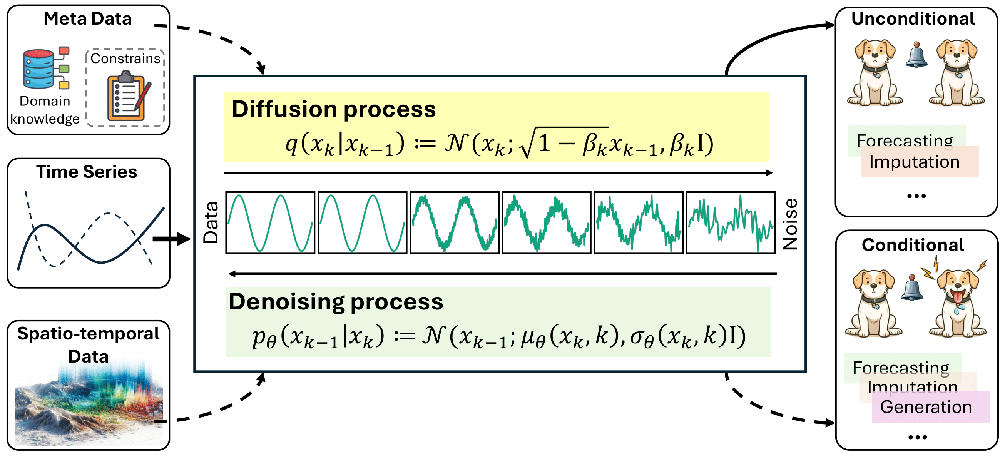

# Diffusion Model for Time Series and Spatio-Temporal Data

[](https://awesome.re) 
 

[](https://badges.pufler.dev/visits/yyysjz1997/Awesome-TimeSeries-SpatioTemporal-Diffusion-Model)


A curated list of **Diffusion Models** for **Time Series**, **SpatioTemporal Data** and **Tabular Data** with awesome resources (paper, code, application, review, survey, etc.), which aims to comprehensively and systematically summarize the recent advances to the best of our knowledge.

We will continue to update this list with the newest resources. If you find any missed resources (paper/code) or errors, please feel free to open an issue or make a pull request.

## A Survey on Diffusion Models for Time Series and Spatio-Temporal Data

<div align="center">
      
**[<a href="https://arxiv.org/abs/2404.18886">Paper Page</a>]**
**[<a href="https://mp.weixin.qq.com/s/yUo6NDDeMRHAqoKk5RPZdg">专知 中文解读</a>]**
**[<a href="https://mp.weixin.qq.com/s/bWEckT9eXfrr-AWehPOYtw">时序人 中文解读</a>]**
**[<a href="https://zhuanlan.zhihu.com/p/696930711">知乎 中文解读</a>]**
**[[All Summarized and Categorized Papers](https://docs.google.com/spreadsheets/d/1X5ujA-yXCzkzz4Uu9ErP8mu_Jg2zWk4fwZrwrMcqMoI/edit#gid=0)]**

</div>


**Authors**: Yiyuan Yang, Ming Jin, Haomin Wen, Chaoli Zhang, Yuxuan Liang*, Lintao Ma, Yi Wang, Chenghao Liu, Bin Yang, Zenglin Xu, Jiang Bian, Shirui Pan, Qingsong Wen*

||
|:--:| 
| *Figure 1. An overview of diffusion models for time series and spatio-temporal data analysis.* |

🙋 Please let us know if you find a mistake or have any suggestions!

✨ If you found this survey and repository useful, please consider to star this repository and cite our survey paper:

```bibtex
@article{yang2024survey,
      title={A Survey on Diffusion Models for Time Series and Spatio-Temporal Data}, 
      author={Yiyuan Yang and Ming Jin and Haomin Wen and Chaoli Zhang and Yuxuan Liang and Lintao Ma and Yi Wang and Chenghao Liu and Bin Yang and Zenglin Xu and Jiang Bian and Shirui Pan and Qingsong Wen},
      year={2024},
      eprint={2404.18886},
      archivePrefix={arXiv},
      primaryClass={cs.LG}
}
```

## Taxonomy Document

✨ **[[Paper List and Taxonomy](https://docs.google.com/spreadsheets/d/1X5ujA-yXCzkzz4Uu9ErP8mu_Jg2zWk4fwZrwrMcqMoI/edit#gid=0)]**.

🙋 Please feel free to submit comments on any new works!


## Contents

- [Diffusion Model for Time Series and SpatioTemporal Data](#diffusion-model-for-time-series-and-spatiotemporal-data)
  - [Contents](#contents)
  - [Diffusion Model for Time Series Data](#diffusion-model-for-time-series-data)
    - [Prediction](#prediction)
    - [Generation](#generation)
    - [Imputation](#imputation)
    - [Anomaly Detection](#anomaly-detection)
    - [Classification and Regression](#classification-and-regression)
    - [Causal Inference](#causal-inference)
    - [Event Prediction and Classification](#event-prediction-and-classification)
    - [Foundation Model](#foundation-model)
  - [Diffusion Model for SpatioTemporal Data](#diffusion-model-for-spatiotemporal-data)
  - [Diffusion Model for Tabular Data](#diffusion-model-for-tabular-data)
  - [Applications](#applications)
    - [Healthcare](#healthcare)
    - [Sequential Recommendation](#sequential-recommendation)
    - [Weather](#weather)
    - [Energy and Electricity](#energy-and-electricity)
    - [Math and Physics](#math-and-physics)
    - [Finance](#finance)
    - [AIOps](#aiops)
    - [Environment](#environment)
    - [Traffic](#traffic)
    - [Manufacturing](#manufacturing)
    - [Audio](#audio)
    - [Biology](#biology)
    - [Communication](#communication)
  - [Related Diffusion Model Resources and Surveys](#related-diffusion-model-resources-and-surveys)


## Diffusion Model for Time Series Data

### Prediction

* Autoregressive Denoising Diffusion Models for Multivariate Probabilistic Time Series Forecasting, in *ICML* 2021. [[paper](https://arxiv.org/abs/2101.12072)] [[official-code](https://github.com/zalandoresearch/pytorch-ts)]

* ScoreGrad: Multivariate Probabilistic Time Series Forecasting with Continuous Energy-based Generative Models, in *ArXiv* 2021. [[paper](https://arxiv.org/abs/2106.10121)] [[official-code](https://github.com/yantijin/ScoreGradPred)]

* Generative Time Series Forecasting with Diffusion, Denoise, and Disentanglement, in *NeurIPS* 2022. [[paper](https://arxiv.org/abs/2301.03028)] [[official-code](https://github.com/PaddlePaddle/PaddleSpatial/tree/main/research/D3VAE)]

* Diffusion Variational Autoencoder for Tackling Stochasticity in Multi-Step Regression Stock Price Prediction, in *CIKM* 2023. [[paper](https://arxiv.org/abs/2309.00073)] [[official-code](https://github.com/koa-fin/dva)]

* Modeling Temporal Data as Continuous Functions with Process Diffusion, in *ICML* 2023. [[paper](https://arxiv.org/abs/2211.02590)]

* Non-autoregressive Conditional Diffusion Models for Time Series Prediction, in *ICML* 2023. [[paper](https://dl.acm.org/doi/10.5555/3618408.3619692)]

* Graph Convolution Recurrent Denoising Diffusion Model for Multivariate Probabilistic Temporal Forecasting, in *International Conference on Advanced Data Mining and Applications (ADMA)* 2023. [[paper](https://dl.acm.org/doi/10.5555/3618408.3619692)]

* Data-driven and knowledge-guided denoising diffusion model for flood forecasting, in *Expert Systems with Applications* 2023. [[paper](https://www.sciencedirect.com/science/article/pii/S0957417423034103)]

* Generative Time Series Forecasting with Diffusion, Denoise, and Disentanglement, in *ArXiv* 2023. [[paper](https://arxiv.org/abs/2301.03028)] [[official-code](https://github.com/paddlepaddle/paddlespatial)]

* DiffECG: A Generalized Probabilistic Diffusion Model for ECG Signals Synthesis, in *ArXiv* 2023. [[paper](https://arxiv.org/abs/2306.01875)]

* Predict, Refine, Synthesize: Self-Guiding Diffusion Models for Probabilistic Time Series Forecasting, in *ArXiv* 2023. [[paper](https://arxiv.org/abs/2307.11494)]

* Data Augmentation for Seizure Prediction with Generative Diffusion Model, in *ArXiv* 2023. [[paper](https://arxiv.org/abs/2306.08256)]

* DiffLoad: Uncertainty Quantification in Load Forecasting with Diffusion Model, in *ArXiv* 2023. [[paper](https://arxiv.org/abs/2306.01001)]

* Denoising Diffusion Probabilistic Models for Probabilistic Energy Forecasting, in *ArXiv* 2023. [[paper](https://arxiv.org/abs/2212.02977)] [[official-code](https://github.com/EstebanHernandezCapel/DDPM-Power-systems-forecasting)]

* TDSTF: Transformer-based Diffusion probabilistic model for Sparse Time series Forecasting, in *ArXiv* 2023. [[paper](https://arxiv.org/abs/2301.06625)] [[official-code](https://github.com/pingchang818/tdstf)]

* Graph Convolution Recurrent Denoising Diffusion Model for Multivariate Probabilistic Temporal Forecasting, *Working Paper* 2023. [[link](https://aip.riken.jp/events/event_154762/)]

* Latent Diffusion Models for Generative Precipitation Nowcasting with Accurate Uncertainty Quantification, in *ArXiv* 2023. [[paper](https://arxiv.org/abs/2304.12891)] [[official-code](https://github.com/MeteoSwiss/ldcast)]

* WiREDiff: a Wind Resolution-Enhancing Diffusion Model, in *Working Paper* 2023. [[link](https://rupakv.com/wirediff.html#:~:text=WiREDiff%20is%20a%20novel%20application,interval%20of%20predicted%20wind%20velocities.)] [[paper](https://rupakv.com/pdfs/wirediff_report.pdf)] [[official-code](https://github.com/RupaKurinchiVendhan/WiREDiff)]

* A novel gear RUL prediction method by diffusion model generation health index and attention guided multi-hierarchy LSTM, in *Scientific Reports* 2024. [[paper](https://www.nature.com/articles/s41598-024-52151-y)]

* A transformer-based diffusion probabilistic model for heart rate and blood pressure forecasting in Intensive Care Unit, in *Computer Methods and Programs in Biomedicine* 2024. [[paper](https://www.sciencedirect.com/science/article/pii/S0169260724000567)] [[official-code](https://github.com/PingChang818/TDSTF)]

* Quantifying uncertainty: Air quality forecasting based on dynamic spatial-temporal denoising diffusion Probabilistic model, in *Environmental Research* 2024. [[paper](https://www.sciencedirect.com/science/article/pii/S0013935124003426)]

* DiffSTOCK: Probabilistic relational Stock Market Predictions using Diffusion Models, in *ICASSP* 2024. [[paper](https://arxiv.org/pdf/2403.14063)]

* Multi-Modality Conditional Diffusion Model for Time Series Forecasting of Live Sales Volume, in *ICASSP* 2024. [[paper](https://ieeexplore.ieee.org/abstract/document/10446307)]
  
* Latent Diffusion Transformer for Probabilistic Time Series Forecasting, in *AAAI* 2024. [[paper](https://ojs.aaai.org/index.php/AAAI/article/view/29085)]

* Comparative Analysis of TEC Prediction Models During Geomagnetic Storm and Quiet Conditions Using Diffusion, Transformer, and SARIMA, 2024. [[paper](https://essopenarchive.org/doi/full/10.22541/essoar.171291801.18571788/v1)]

* Residential Customer Baseline Load Estimation Based on Conditional Denoising Diffusion Probabilistic Model, in *IEEE 4th International Conference in Power Engineering Applications (ICPEA)* 2024. [[paper](https://ieeexplore.ieee.org/abstract/document/10498265)]

* Variational Schrödinger Diffusion Models, in *ICML* 2024. [[paper](https://arxiv.org/abs/2405.04795)]

* Diff-MGR: Dynamic Causal Graph Attention and Pattern Reproduction Guided Diffusion Model for Multivariate Time Series Probabilistic Forecasting, in *Information Sciences* 2024. [[paper](https://www.sciencedirect.com/science/article/pii/S002002552400656X)]

* Multi-modal transform-based fusion model for new product sales forecasting, in *Engineering Applications of Artificial Intelligence* 2024. [[paper](https://www.sciencedirect.com/science/article/pii/S0952197624007644)]

* Probabilistic Building Load Forecasting via Conditional Diffusion Model, in *e-Energy* 2024. [[paper](https://dl.acm.org/doi/pdf/10.1145/3632775.3661980)]

* Probabilistic Time Series Modeling with Decomposable Denoising Diffusion Model, in *ICML* 2024. [[paper](https://openreview.net/pdf?id=BNH8spaR3l)]

* Data-driven and knowledge-guided denoising diffusion probabilistic model for runoff uncertainty prediction, in *Journal of Hydrology* 2024. [[paper](https://www.sciencedirect.com/science/article/pii/S0022169424009521)]

* DiffDA: a diffusion model for weather-scale data assimilation, in *ArXiv* 2024. [[paper](https://arxiv.org/abs/2401.05932)]

* DiffPLF: A Conditional Diffusion Model for Probabilistic Forecasting of EV Charging Load, in *ArXiv* 2024. [[paper](https://arxiv.org/abs/2402.13548)] [[official-code](https://github.com/LSY-Cython/DiffPLF)]

* CogDPM: Diffusion Probabilistic Models via Cognitive Predictive Coding, in *ArXiv* 2024. [[paper](https://arxiv.org/abs/2405.02384)]

* Self-Supervised Learning of Time Series Representation via Diffusion Process and Imputation-Interpolation-Forecasting Mask, in *ArXiv* 2024. [[paper](https://arxiv.org/abs/2405.05959)] [[official-code](https://github.com/EQTPartners/TSDE)]

* Generative Pre-Trained Diffusion Paradigm for Zero-Shot Time Series Forecasting, in *ArXiv* 2024. [[paper](https://arxiv.org/pdf/2406.02212)]

* Stochastic Diffusion: A Diffusion Probabilistic Model for Stochastic Time Series Forecasting, in *ArXiv* 2024. [[paper](https://arxiv.org/pdf/2406.02827)]

* Treeffuser: Probabilistic Predictions via Conditional Diffusions with Gradient-Boosted Trees, in *ArXiv* 2024. [[paper](https://arxiv.org/pdf/2406.07658)] [[official-code](https://github.com/blei-lab/treeffuser)]

* DiffLoad: Uncertainty Quantification in Electrical Load Forecasting with the Diffusion Model, in *IEEE Transactions on Power Systems* 2024. [[paper](https://ieeexplore.ieee.org/stamp/stamp.jsp?tp=&arnumber=10645307)] [[official-code](https://github.com/hkuedl/DiffLoad-Uncertainty-Quantification-Load-Forecasting)]

* A novel wind power forecast diffusion model based on prior knowledge, in *IET Renewable Power Generation* 2024. [[paper](https://ietresearch.onlinelibrary.wiley.com/doi/pdf/10.1049/rpg2.13087)]

* RespDiff: An End-to-End Multi-scale RNN Diffusion Model for Respiratory Waveform Estimation from PPG Signals, in *ArXiv* 2024. [[paper](https://www.researchgate.net/publication/383988916_RespDiff_An_End-to-End_Multi-scale_RNN_Diffusion_Model_for_Respiratory_Waveform_Estimation_from_PPG_Signals)]

* PV-Diff: Probability Prediction of Short-term Photovoltaic Power Interval Based on Conditional Diffusion Model, in *Chinese Control Conference* 2024. [[paper](https://ieeexplore.ieee.org/stamp/stamp.jsp?tp=&arnumber=10661972)]

* BP-Diff: a conditional diffusion model for cuffless continuous BP waveform estimation using U-Net, in *Physiological Measurement* 2024. [[paper](https://iopscience.iop.org/article/10.1088/1361-6579/ad7fcc/meta)]

* Treating Brain-inspired Memories as Priors for Diffusion Model to Forecast Multivariate Time Series, in *ArXiv* 2024. [[paper](https://arxiv.org/pdf/2409.18491)]

* Channel-aware Contrastive Conditional Diffusion for Multivariate Probabilistic Time Series Forecasting, in *ArXiv* 2024. [[paper](https://arxiv.org/pdf/2410.02168)] [[official-code](https://github.com/LSY-Cython/CCDM)]

* DifFaiRec: Generative Fair Recommender with Conditional Diffusion Model, in *ArXiv* 2024. [[paper](https://arxiv.org/pdf/2410.02791)]

* EEG-DIF: Early Warning of Epileptic Seizures through Generative Diffusion Model-based Multi-channel EEG Signals Forecasting, in *ArXiv* 2024. [[paper](https://arxiv.org/pdf/2410.17343)] [[official-code](https://github.com/JZK00/EEG-DIF)]

* Retrieval-Augmented Diffusion Models for Time Series Forecasting, in *ArXiv* 2024. [[paper](https://arxiv.org/pdf/2410.18712)] [[official-code](https://github.com/stanliu96/RATD)]

* Diffusion-driven Incomplete Multimodal Learning for Air Quality Prediction, in *ACM Transactions on Internet of Things* 2024. [[paper](https://dl.acm.org/doi/abs/10.1145/3702243)] [[official-code](https://github.com/pestasu/IMMAir)]

* DiffBatt: A Diffusion Model for Battery Degradation Prediction and Synthesis, in *ArXiv* 2024. [[paper](https://arxiv.org/pdf/2410.23893)] [[official-code]( https://github.com/HamidrezaEiv/DiffBatt.git)]

* Time Series Prediction Based on the Probability Diffusion Model, in *IEEE Information Technology, Networking, Electronic and Automation Control Conference* 2024. [[paper](https://ieeexplore.ieee.org/document/10733342)]

* RNDiff: Rainfall Nowcasting with Condition Diffusion Model, in *Pattern Recognition* 2024. [[paper](https://www.sciencedirect.com/science/article/pii/S0031320324009440)] [[official-code](https://github.com/ybu-lxd/SRNDiff)]

* A Diffusion–Attention-Enhanced Temporal (DATE-TM) Model: A Multi-Feature-Driven Model for Very-Short-Term Household Load Forecasting, in *Energies* 2025. [[paper](https://www.mdpi.com/1996-1073/18/3/486)]

* Unveiling the Power of Noise Priors: Enhancing Diffusion Models for Mobile Traffic Prediction, in *ArXiv* 2025. [[paper](https://arxiv.org/pdf/2501.13794)]


### Generation

* WaveGrad: Estimating Gradients for Waveform Generation, in *ICLR* 2021. [[paper](https://arxiv.org/abs/2009.00713)]

* DiffWave: A Versatile Diffusion Model for Audio Synthesis, in *ICLR* 2021. [[paper](https://arxiv.org/abs/2009.09761)] [[official-code](https://diffwave-demo.github.io/)]

* CSDI: Conditional Score-based Diffusion Models for Probabilistic Time Series Imputation, in *NeurIPS* 2021. [[paper](https://arxiv.org/pdf/2107.03502)] [[official-code](https://github.com/ermongroup/csdi)]

* Conditional Simulation Using Diffusion Schrödinger Bridges, in *UAI* 2022. [[paper](https://arxiv.org/abs/2202.13460)] [[official-code](https://github.com/vdeborto/cdsb)]

* Diffusing Gaussian Mixtures for Generating Categorical Data, in *AAAI* 2023. [[paper](https://arxiv.org/abs/2303.04635)] [[official-code](https://github.com/networkslab/gmcd)]

* Diffusion Generative Models in Infinite Dimensions, in *AISTATS* 2023. [[paper](https://arxiv.org/abs/2212.00886)] [[official-code](https://github.com/gavinkerrigan/functional_diffusion)]

* Multi-scale Conditional Diffusion Model for Deposited Droplet Volume Measurement in Inkjet Printing Manufacturing, in *Journal of Manufacturing Systems* 2023. [[paper](https://www.sciencedirect.com/science/article/pii/S0278612523002042)]
 
* Diffusion Augmentation for Sequential Recommendation, in *CIKM* 2023. [[paper](https://dl.acm.org/doi/abs/10.1145/3583780.3615134)] [[official-code](https://github.com/liuqidong07/DiffuASR)]

* Short-Term Wind Power Scenario Generation Based on Conditional Latent Diffusion Models, in *IEEE Transactions on Sustainable Energy* 2023. [[paper](https://ieeexplore.ieee.org/abstract/document/10296015)]

* Synthetic Sleep EEG Signal Generation using Latent Diffusion Models, in *DGM4H NeurIPS* 2023. [[paper](https://openreview.net/forum?id=mDwURmlapW)] [[official-code](https://github.com/bruAristimunha/Synthetic-Sleep-EEG-Signal-Generation-using-Latent-Diffusion-Models)]

* Generative AI Enables the Detection of Autism Using EEG Signals, in *Biometric Recognition* 2023. [[paper](https://link.springer.com/chapter/10.1007/978-981-99-8565-4_35)]

* TimeDDPM: Time series augmentation strategy for industrial soft sensing, in *IEEE Sensors Journal* 2023. [[paper](https://ieeexplore.ieee.org/abstract/document/10353969)]

* Conditioning Score-Based Generative Models by Neuro-Symbolic Constraints, in *ArXiv* 2023. [[paper](https://arxiv.org/abs/2308.16534)]

* TransFusion: Generating Long, High Fidelity Time Series using Diffusion Models with Transformers, in *ArXiv* 2023. [[paper](https://arxiv.org/abs/2307.12667)]

* On the Constrained Time-Series Generation Problem, in *ArXiv* 2023. [[paper](https://arxiv.org/abs/2307.01717)]

* DiffECG: A Generalized Probabilistic Diffusion Model for ECG Signals Synthesis, in *ArXiv* 2023. [[paper](https://arxiv.org/abs/2306.01875)]

* Customized Load Profiles Synthesis for Electricity Customers Based on Conditional Diffusion Models, in *ArXiv* 2023. [[paper](https://arxiv.org/abs/2304.12076)]

* Synthetic Health-related Longitudinal Data with Mixed-type Variables Generated using Diffusion Models, in *ArXiv* 2023. [[paper](https://arxiv.org/abs/2303.12281)]

* EHRDiff: Exploring Realistic EHR Synthesis with Diffusion Models, in *ArXiv* 2023. [[paper](https://arxiv.org/abs/2303.05656)] [[official-code](https://github.com/sczzz3/ehrdiff)]

* Synthesizing Mixed-type Electronic Health Records using Diffusion Models, in *ArXiv* 2023. [[paper](https://arxiv.org/abs/2302.14679)]

* MedDiff: Generating Electronic Health Records using Accelerated Denoising Diffusion Model, in *ArXiv* 2023. [[paper](https://arxiv.org/abs/2302.04355)]

* Fast and Reliable Generation of EHR Time Series via Diffusion Models, in *ArXiv* 2023. [[paper](https://arxiv.org/abs/2310.15290)]

* Fast Diffusion GAN Model for Symbolic Music Generation Controlled by Emotions, in *ArXiv* 2023. [[paper](https://arxiv.org/abs/2310.14040)]

* TS-Diffusion: Generating Highly Complex Time Series with Diffusion Models, in *ArXiv* 2023. [[paper](https://arxiv.org/abs/2311.03303)]

* Reliable Generation of EHR Time Series via Diffusion Models, in *ArXiv* 2023. [[paper](https://arxiv.org/abs/2310.15290v2)]

* D3A-TS: Denoising-Driven Data Augmentation in Time Series, in *ArXiv* 2023. [[paper](https://arxiv.org/abs/2312.05550)]

* Time Series Diffusion Method: A Denoising Diffusion Probabilistic Model for Vibration Signal Generation, in *ArXiv* 2023. [[paper](https://arxiv.org/abs/2312.07981)]

* Bayesian ECG reconstruction using denoising diffusion generative models, in *ArXiv* 2023. [[paper](https://arxiv.org/abs/2401.05388)]

* Regular Time-series Generation using SGM, in *ArXiv* 2023. [[paper](https://arxiv.org/abs/2301.08518)]

* On the Constrained Time-Series Generation Problem, in *ArXiv* 2023. [[paper](https://arxiv.org/abs/2307.01717)]

* A Short-Term Wind Power Scenario Generation Method Based on Conditional Diffusion Model, in *IEEE Sustainable Power and Energy Conference (iSPEC)* 2023. [[paper](https://ieeexplore.ieee.org/abstract/document/10403004)]

* Scenario Generation of Renewable Energy Based on Improved Diffusion Model, in *IEEE Sustainable Power and Energy Conference (iSPEC)* 2023. [[paper](https://ieeexplore.ieee.org/abstract/document/10402981)]

* DiffuseRoll: multi-track multi-attribute music generation based on diffusion model, in *Multimedia Systems* 2024. [[paper](https://link.springer.com/article/10.1007/s00530-023-01220-9)] [[official-code](https://github.com/Fairywang9/DiffuseRoll)]
 
* Cold Diffusion Model for Seismic Denoising, 2024. [[paper](https://essopenarchive.org/users/750010/articles/721094-cold-diffusion-model-for-seismic-denoising)] [[official-code](https://github.com/Daniele-Trappolini/Diffusion-Model-for-Earthquake)]

* Conditional Diffusion Models as Self-supervised Learning Backbone for Irregular Time Series, in *ICLR Workshop on Learning from Time Series for Health* 2024. [[paper](https://scholar.google.com/scholar_url?url=https://openreview.net/pdf%3Fid%3DFay67M5R3R&hl=zh-CN&sa=X&d=3311036968068113244&ei=nV30ZZbIN7fHy9YPzam-kA8&scisig=AFWwaebu_vMvKQsDYVUKUZX9Li2u&oi=scholaralrt&hist=FUuGvZIAAAAJ:247144137884962227:AFWwaeY3zXyko7quKq0AnllX_8U0&html=&pos=0&folt=kw)]

* Synthetic Asset Price Paths Generation Using Denoising Diffusion Probabilistic Model, in *SCML* 2024. [[paper](http://scml.jp/2024/paper/8/CameraReady/scml2024.pdf)]

* Generation of synthetic whole-slide image tiles of tumours from RNA-sequencing data via cascaded diffusion models, in *Nature Biomedical Engineering* 2024. [[paper](https://www.nature.com/articles/s41551-024-01193-8#peer-review)] [[official-code](https://rna-cdm.stanford.edu/Download_Code)]

* Mitigating Class Imbalance in Time Series with Enhanced Diffusion Models, in *IWINAC* 2024. [[paper](https://link.springer.com/chapter/10.1007/978-3-031-61137-7_36)]

* Detection and Imputation Based Two-Stage Denoising Diffusion Power System Measurement Recovery Under Cyber-Physical Uncertainties, in *IEEE Transactions on Smart Grid* 2024. [[paper](https://ieeexplore.ieee.org/abstract/document/10542391)]

* A diffusion model-based framework USDDM for random noise elimination of seismic signal, in *Earth Science Informatics* 2024. [[paper](https://link.springer.com/article/10.1007/s12145-024-01333-3)]

* Fingerprinting in EEG Model IP Protection Using Diffusion Model, in *ICMR* 2024. [[paper](https://dl.acm.org/doi/abs/10.1145/3652583.3658057)]

* Pre-training Feature Guided Diffusion Model for Speech Enhancement, in *Interspeech* 2024. [[paper](https://arxiv.org/abs/2406.07646)]

* Multivariate Time-series Diffusion Model-based Generation of Transient Trajectories for Power System Applications, in *IEEE/PES Transmission and Distribution Conference and Exposition (T&D)* 2024. [[paper](https://ieeexplore.ieee.org/stamp/stamp.jsp?tp=&arnumber=10556088)]

* SeisResoDiff: Seismic resolution enhancement based on a diffusion model, in *Petroleum Science* 2024. [[paper](https://www.sciencedirect.com/science/article/pii/S1995822624001869)]

* Enabling Diffusion Model for Conditioned Time Series Generation, in *Engineering Proceedings* 2024. [[paper](https://www.mdpi.com/2673-4591/68/1/25)]

* Learning Joint 2-D and 3-D Graph Diffusion Models for Complete Molecule Generation, in *IEEE Transactions on Neural Networks and Learning Systems* 2024. [[paper](https://ieeexplore.ieee.org/stamp/stamp.jsp?tp=&arnumber=10589299)]

* DiffusionLSTM: A Framework for Image Sequence Generation and its Application to Oil Spill Monitoring and Prediction, in *IEEE Transactions on Geoscience and Remote Sensing* 2024. [[paper](https://ieeexplore.ieee.org/abstract/document/10589663/)]

* Parameter sharing fault data generation method based on diffusion model under imbalance data, in *Measurement Science and Technology* 2024. [[paper](https://iopscience.iop.org/article/10.1088/1361-6501/ad5de9)]

* DF-CDM: Conditional diffusion model with data fusion for structural dynamic response reconstruction, in *Mechanical Systems and Signal Processing* 2024. [[paper](https://www.sciencedirect.com/science/article/pii/S0888327024006812)]

* Combining audio control and style transfer using latent diffusion, in *ISMIR* 2024. [[paper](https://arxiv.org/pdf/2408.00196)] [[official-code](https://github.com/NilsDem/control-transfer-diffusion/)]

* DiffPhys: Enhancing Signal-to-Noise Ratio in Remote Photoplethysmography Signal Using a Diffusion Model Approach, in *Bioengineering* 2024. [[paper](https://www.mdpi.com/2306-5354/11/8/743)]

* Data augmentation based on diffusion probabilistic model for remaining useful life estimation of aero-engines, in *Reliability Engineering and System Safety* 2024. [[paper](https://www.sciencedirect.com/science/article/pii/S0951832024004666)]

* ECGDiff: Conditional Diffusion Model for ECG Reconstruction from Doppler Signals, in *IEEE International Conference on Communications* 2024. [[paper](https://ieeexplore.ieee.org/stamp/stamp.jsp?tp=&arnumber=10622196)]

* NetDiff: A Service-Guided Hierarchical Diffusion Model for Network Flow Trace Generation, in *Proceedings of the ACM on Networking* 2024. [[paper](https://dl.acm.org/doi/pdf/10.1145/3676870)]

* Synthesizing EEG Signals from Event-Related Potential Paradigms with Conditional Diffusion Models, in *ArXiv* 2024. [[paper](https://arxiv.org/pdf/2403.18486)]

* Creating synthetic energy meter data using conditional diffusion and building metadata, in *ArXiv* 2024. [[paper](https://arxiv.org/pdf/2404.00525v1)] [[official-code](https://github.com/buds-lab/energy-diffusion)]

* Balanced Mixed-Type Tabular Data Synthesis with Diffusion Models, in *ArXiv* 2024. [[paper](https://arxiv.org/pdf/2404.08254)]

* Long-form music generation with latent diffusion, in *ArXiv* 2024. [[paper](https://arxiv.org/pdf/2404.10301)] [[official-code](https://github.com/Stability-AI/stable-audio-tools/)]

* Cross-sensor super-resolution of irregularly sampled Sentinel-2 time series, in *ArXiv* 2024. [[paper](https://arxiv.org/abs/2404.16409)] [[official-code](https://github.com/aimiokab/MISR-S2)]

* BioDiffusion: A Versatile Diffusion Model for Biomedical Signal Synthesis, in *ArXiv* 2024. [[paper](https://arxiv.org/abs/2401.10282)][[official-code](https://github.com/imics-lab/biodiffusion)]
 
* Risk-Sensitive Diffusion: Learning the Underlying Distribution from Noisy Samples, in *arXiv* 2024. [[paper](https://arxiv.org/abs/2402.02081)]

* Time Series Diffusion in the Frequency Domain, in *ArXiv* 2024. [[paper](https://arxiv.org/abs/2402.05933)][[official-code](https://github.com/JonathanCrabbe/FourierDiffusion)]

* DiffsFormer: A Diffusion Transformer on Stock Factor Augmentation, in *ArXiv* 2024. [[paper](https://arxiv.org/abs/2402.06656v1)]

* Time Weaver: A Conditional Time Series Generation Model, in *ArXiv* 2024. [[paper](https://arxiv.org/pdf/2403.02682v1)]

* Plug-in Diffusion Model for Sequential Recommendation, in *ArXiv* 2024. [[paper](https://arxiv.org/pdf/2401.02913.pdf)][[official-code](https://github.com/hulkima/PDRec)]

* Generating Synthetic Net Load Data with Physics-informed Diffusion Model, in *ArXiv* 2024. [[paper](https://arxiv.org/pdf/2406.01913)]

* SigDiffusions: Score-Based Diffusion Models for Long Time Series via Log-Signature Embeddings, in *ArXiv* 2024. [[paper](https://arxiv.org/abs/2406.10354)]

* Deep Temporal Deaggregation: Large-Scale Spatio-Temporal Generative Models, in *ArXiv* 2024. [[paper](https://arxiv.org/pdf/2406.12423)]

* TimeAutoDiff: Combining Autoencoder and Diffusion model for time series tabular data synthesizing, in *ArXiv* 2024. [[paper](https://arxiv.org/pdf/2406.16028)]

* Diffusion Forcing: Next-token Prediction Meets Full-Sequence Diffusion, in *ArXiv* 2024. [[paper](https://arxiv.org/abs/2407.01392)][[official-code](https://github.com/buoyancy99/diffusion-forcing)]

* TimeLDM: Latent Diffusion Model for Unconditional Time Series Generation, in *ArXiv* 2024. [[paper](https://arxiv.org/pdf/2407.04211)]

* Latent Diffusion for Neural Spiking Data, in *ArXiv* 2024. [[paper](https://arxiv.org/pdf/2407.08751)][[official-code](https://github.com/mackelab/LDNS)]

* Diff-MTS: Temporal-Augmented Conditional Diffusion-based AIGC for Industrial Time Series Towards the Large Model Era, in *ArXiv* 2024. [[paper](https://arxiv.org/pdf/2407.11501)]

* SSSD-ECG-nle: New Label Embeddings with Structured State-Space Models for ECG generation, in *ArXiv* 2024. [[paper](https://arxiv.org/pdf/2407.11108)][[official-code](https://github.com/ispras/EcgLib)]

* EnergyDiff: Universal Time-Series Energy Data Generation using Diffusion Models, in *ArXiv* 2024. [[paper](https://arxiv.org/pdf/2407.13538)]

* Unsupervised Blind Joint Dereverberation and Room Acoustics Estimation with Diffusion Models, in *ArXiv* 2024. [[paper](https://arxiv.org/pdf/2408.07472)][[official-code](https://github.com/sp-uhh/buddy)]

* PatchEMG: Few-Shot EMG Signal Generation With Diffusion Models for Data Augmentation to Improve Classification Performance, in *IEEE Transactions on Instrumentation and Measurement* 2024. [[paper](https://ieeexplore.ieee.org/stamp/stamp.jsp?tp=&arnumber=10648713)]

* A Financial Time Series Denoiser Based on Diffusion Model, in *ArXiv* 2024. [[paper](https://arxiv.org/pdf/2409.02138)]

* DiffEyeSyn: Diffusion-based User-specific Eye Movement Synthesis, in *ArXiv* 2024. [[paper](https://arxiv.org/pdf/2409.01240)]

* Classification of imbalanced ECGs through segmentation models and augmented by conditional diffusion model, in *Peer J Computer Science* 2024. [[paper](https://peerj.com/articles/cs-2299/)]

* Protecting Activity Sensing Data Privacy Using Hierarchical Information Dissociation, in *ArXiv* 2024. [[paper](https://arxiv.org/pdf/2409.03796)]

* Few-Shot PPG Signal Generation via Guided Diffusion Models, in *IEEE Sensors Journal* 2024. [[paper](https://ieeexplore.ieee.org/stamp/stamp.jsp?tp=&arnumber=10680298)]

* Enhancing EEG Signal Generation through a Hybrid Approach Integrating Reinforcement Learning and Diffusion Models, in *ArXiv* 2024. [[paper](https://arxiv.org/pdf/2410.00013)]

* GADM: Data augmentation using Generative Adversarial Diffusion Model for pulse-based disease identification, in *Biomedical Signal Processing and Control* 2024. [[paper](https://www.sciencedirect.com/science/article/pii/S1746809424010632)] [[official-code](https://github.com/dreaming12138/GADM-Generative-Adversarial-Diffusion-Model)]

* Generation of synthetic financial time series by diffusion models, in *ArXiv* 2024. [[paper](https://arxiv.org/pdf/2410.18897)]

* Utilizing Image Transforms and Diffusion Models for Generative Modeling of Short and Long Time Series, in *ArXiv*, 2024. [[paper](https://arxiv.org/pdf/2410.19538)] [[official-code](https://github.com/azencot-group/ImagenTime)]

* Federated Time Series Generation on Feature and Temporally Misaligned Data, in *ArXiv*, 2024. [[paper](https://arxiv.org/pdf/2410.21072)]

* Towards Editing Time Series, in *Openreview* 2024. [[paper](https://openreview.net/pdf?id=qu5NTwZtxA)] )] [[official-code]( https://seqml.github.io/tse/)]

* FIDE: Frequency-Inflated Conditional Diffusion Model for Extreme-Aware Time Series Generation, in *NeurIPS* 2024. [[paper](https://openreview.net/pdf?id=5HQhYiGnYb)] [[official-code](https://github.com/galib19/FIDE)]

* EEGDfus: A Conditional Diffusion Model for Fine-Grained EEG Denoising, *IEEE Journal of Biomedical and Health Informatics*, 2024. [[paper](https://ieeexplore.ieee.org/stamp/stamp.jsp?tp=&arnumber=10763506)] [[official-code](https://github.com/XYH0118/EEGDfus)]

* Regional Features Conditioned Diffusion Models for 5G Network Traffic Generation, *SIGSPATIAL*, 2024. [[paper](https://dl.acm.org/doi/pdf/10.1145/3678717.3691312)]

* An AIGC-driven Score-Based Diffusion Approach for Industrial Time Series, in *IEEE Internet of Things Journal* 2024. [[paper](https://ieeexplore.ieee.org/stamp/stamp.jsp?tp=&arnumber=10785562)]

* Sparsity Measures-Enhanced Targeted Diffusion Probabilistic Model for Acoustic Signal Recovery, in *IEEE Transactions on Instrumentation and Measurement* 2024. [[paper](https://ieeexplore.ieee.org/stamp/stamp.jsp?tp=&arnumber=10802969)]

* Guided Diffusion Model for Sensor Data Obfuscation, in *ArXiv* 2024. [[paper](https://arxiv.org/pdf/2412.14499)]

* Population Aware Diffusion for Time Series Generation, in *AAAI* 2025. [[paper](https://arxiv.org/pdf/2501.00910)] [[official-code](https://github.com/wmd3i/PaD-TS)]

* TAMHA-DDPM: A Time-Aware Multi-Head Attention Denoising Diffusion Probability Model for Fuzzy Data Optimization in Intelligent Transportation Systems, in *IEEE Transactions on Intelligent Transportation Systems* 2024. [[paper](https://ieeexplore.ieee.org/abstract/document/10817476)]

* Biomedically Informed ECG Synthesis: Customizing Cardiac Cycle Phases with Diffusion Model, in *International Conference on Bioinformatics and Biomedicine (BIBM)* 2025. [[paper](https://ieeexplore.ieee.org/stamp/stamp.jsp?arnumber=10821878&casa_token=BZXgxjtGDesAAAAA:5xy7eIq1DJQC5F28lX0nSSz2RzKa4TZBVmstMT383-M0jiBHbexpfutd7T5uZqqalL3QX5g)]

* Generative AI Enables EEG Super-Resolution via Spatio-Temporal Adaptive Diffusion Learning, in *IEEE Transactions on Consumer Electronics* 2025. [[paper](https://ieeexplore.ieee.org/stamp/stamp.jsp?arnumber=10839074)]

* FHRDiff: Leveraging Diffusion Models for Conditional Fetal Heart Rate Signal Generation, in *International Conference on Bioinformatics and Biomedicine (BIBM)* 2024. [[paper](https://ieeexplore.ieee.org/stamp/stamp.jsp?arnumber=10821853&casa_token=KoPfu1SS96YAAAAA:oCg42RkyO96DBmlKlxaFHnA9QqTrEs1MfCF7NWyfuxNP3VQZ3XQx_gRy-LvuAWsyqXyYQMw)]

* TimeDP: Learning to Generate Multi-Domain Time Series with Domain Prompts, in *ArXiv* 2025. [[paper](hhttps://arxiv.org/pdf/2501.05403)]


### Imputation

* CSDI: Conditional Score-based Diffusion Models for Probabilistic Time Series Imputation, in *NeurIPS* 2021. [[paper](https://arxiv.org/abs/2107.03502)] [[official-code](https://github.com/ermongroup/CSDI)]
  
* Modeling Temporal Data as Continuous Functions with Process Diffusion, in *ICML* 2023. [[paper](https://arxiv.org/abs/2211.02590)]

* An Observed Value Consistent Diffusion Model for Imputing Missing Values in Multivariate Time Series, in *KDD* 2023. [[paper](https://dl.acm.org/doi/10.1145/3580305.3599257)]

* Diffusion-based Time Series Imputation and Forecasting with Structured State Space Models, in *Transactions on Machine Learning Research (TMLR)* 2023. [[paper](https://arxiv.org/abs/2208.09399)] [[official-code](https://github.com/ai4healthuol/sssd)]

* Density-Aware Temporal Attentive Step-wise Diffusion Model For Medical Time Series Imputation, in *CIKM* 2023. [[paper](https://dl.acm.org/doi/abs/10.1145/3583780.3614840)]

* MEDiC: Mitigating EEG Data Scarcity Via Class-Conditioned Diffusion Model, in *DGM4H NeurIPS* 2023. [[paper](https://openreview.net/forum?id=0aeDKGhlTo)]

* Missing Data Filling in Soft Sensing Using Denoising Diffusion Probability Model, in *Measurement Science and Technology* 2023. [[paper](https://iopscience.iop.org/article/10.1088/1361-6501/ad095a)]

* Diffusion-Based Time Series Data Imputation for Cloud Failure Prediction at Microsoft 365, in *ESEC/FSE* 2023. [[paper](https://dl.acm.org/doi/abs/10.1145/3611643.3613866)]

* Sasdim: Self-adaptive Noise Scaling Diffusion Model for Spatial Time Series Imputation, in *ArXiv* 2023. [[paper](https://arxiv.org/abs/2309.01988)]

* Improving Diffusion Models for ECG Imputation with an Augmented Template Prior, in *ArXiv* 2023. [[paper](https://arxiv.org/abs/2310.15742)]

* Imputing time-series microbiome abundance profiles with diffusion model, in *IEEE International Conference on Bioinformatics and Biomedicine (BIBM)* 2023. [[paper](https://ieeexplore.ieee.org/abstract/document/10385703)] [[official-code](https://github.com/misatoseki/metag_time_impute)]

* SADI: Similarity-Aware Diffusion Model-Based Imputation for Incomplete Temporal EHR Data, in *International Conference on Artificial Intelligence and Statistics* 2024. [[paper](https://proceedings.mlr.press/v238/dai24c.html)]

* Self-supervision improves diffusion models for tabular data imputation, in *ICLR Workshop on GenAI4DM*. [[paper](https://www.amazon.science/publications/self-supervision-improves-diffusion-models-for-tabular-data-imputation)]

* Probabilistic Time Series Modeling with Decomposable Denoising Diffusion Model, in *ICML* 2024. [[paper](https://openreview.net/pdf?id=BNH8spaR3l)]

* Denoising Diffusion Straightforward Models for Energy Conversion Monitoring Data Imputation, in *IEEE Transactions on Industrial Informatics* 2024. [[paper](https://ieeexplore.ieee.org/abstract/document/10568989)]

* Filling of Fetal Heart Rate Signal: Diffusion Model Based on Dimension Construction and Period Segmentation, in *IEEE Transactions on Consumer Electronics* 2024. [[paper](https://ieeexplore.ieee.org/stamp/stamp.jsp?tp=&arnumber=10591727)]

* MTSCI: A Conditional Diffusion Model for Multivariate Time Series Consistent Imputation, in *CIKM* 2024. [[paper](https://arxiv.org/pdf/2408.05740)] [[official-code](https://github.com/JeremyChou28/MTSCI)]

* DiffsFormer: A Diffusion Transformer on Stock Factor Augmentation, in *ArXiv* 2024. [[paper](https://arxiv.org/abs/2402.06656v1)]

* Self-Supervised Learning of Time Series Representation via Diffusion Process and Imputation-Interpolation-Forecasting Mask, in *ArXiv* 2024. [[paper](https://arxiv.org/abs/2405.05959)] [[official-code](https://github.com/EQTPartners/TSDE)]

* Score-CDM: Score-Weighted Convolutional Diffusion Model for Multivariate Time Series Imputation, in *ArXiv* 2024. [[paper](https://arxiv.org/abs/2405.13075)]

* Rethinking the Diffusion Models for Numerical Tabular Data Imputation from the Perspective of Wasserstein Gradient Flow, in *ArXiv* 2024. [[paper](https://arxiv.org/pdf/2406.15762)]

* Pretrained-Guided Conditional Diffusion Models for Microbiome Data Analysis, in *ArXiv* 2024. [[paper](https://arxiv.org/pdf/2408.07709)][[official-code](https://github.com/wenwenmin/mbVDiT)]

* Latent Space Score-based Diffusion Model for Probabilistic Multivariate Time Series Imputation, in *ArXiv* 2024. [[paper](https://arxiv.org/pdf/2409.08917)]

* TIMBA: Time series Imputation with Bi-directional Mamba Blocks and Diffusion models, in *ArXiv* 2024. [[paper](https://arxiv.org/pdf/2410.05916)]

* DiffImp: Efficient Diffusion Model for Probabilistic Time Series Imputation with Bidirectional Mamba Backbone, in *ArXiv* 2024. [[paper](https://arxiv.org/pdf/2410.13338)]

* Self-attention-based Diffusion Model for Time-series Imputation, in *AAAI Fall Symposium Series* 2024. [[paper](https://ojs.aaai.org/index.php/AAAI-SS/article/view/31827)]

* Frequency-aware Generative Models for Multivariate Time Series Imputation, in *OpenReview* 2024. [[paper](https://openreview.net/pdf?id=UE6CeRMnq3)]

* Boundary-enhanced time series data imputation with long-term dependency diffusion models, in *Knowledge-Based Systems* 2024. [[paper](https://www.sciencedirect.com/science/article/pii/S095070512401551X)]

* DGMI: A diffusion-based generative adversarial framework for multivariate air quality imputation, in *Applied Intelligence* 2025. [[paper](https://link.springer.com/article/10.1007/s10489-025-06240-8)]


### Anomaly Detection

* Imputation-based Time-Series Anomaly Detection with Conditional Weight-Incremental Diffusion Models, in *KDD* 2023. [[paper](https://dl.acm.org/doi/abs/10.1145/3580305.3599391)] [[official-code](https://github.com/ChunjingXiao/DiffAD)]

* Time Series Anomaly Detection using Diffusion-based Models, in *ICDM Workshop* 2023. [[paper](https://arxiv.org/abs/2311.01452)] [[official-code](https://github.com/fbrad/diffusionae)]

* Drift doesn’t Matter: Dynamic Decomposition with Diffusion Reconstruction for Unstable Multivariate Time Series Anomaly Detection, in *NeurIPS* 2023. [[paper](https://openreview.net/pdf?id=aW5bSuduF1)] [[official-code](https://github.com/ForestsKing/D3R)]
 
* Diff-SwinT: An Integrated Framework of Diffusion Model and Swin Transformer for Radar Jamming Recognition, in *Future Internet* 2023. [[paper](https://www.mdpi.com/1999-5903/15/12/374)]

* Diffusion-Based Time Series Data Imputation for Cloud Failure Prediction at Microsoft 365, in *ESEC/FSE* 2023. [[paper](https://dl.acm.org/doi/abs/10.1145/3611643.3613866)]

* ImDiffusion: Imputed Diffusion Models for Multivariate Time Series Anomaly Detection, in *ArXiv* 2023. [[paper](https://arxiv.org/abs/2307.00754)] [[official-code](https://github.com/17000cyh/IMDiffusion)]

* DDMT: Denoising Diffusion Mask Transformer Models for Multivariate Time Series Anomaly Detection, in *ArXiv* 2023. [[paper](https://arxiv.org/abs/2310.08800)] [[official-code](https://github.com/yangchaocheng/DDTM)]

* Generating HSR Bogie Vibration Signals via Pulse Voltage-Guided Conditional Diffusion Model, in *ArXiv* 2023. [[paper](https://arxiv.org/abs/2311.00496)] [[official-code](https://github.com/xuanliu2000/VGCDM)]

* Attention-enhanced conditional-diffusion-based data synthesis for data augmentation in machine fault diagnosis, in *Engineering Applications of Artificial Intelligence* 2024. [[paper](https://www.sciencedirect.com/science/article/pii/S0952197623018808)]

* DiffTAD: Denoising diffusion probabilistic models for vehicle trajectory anomaly detection, in *Knowledge-Based Systems* 2024. [[paper](https://www.sciencedirect.com/science/article/pii/S0950705124000224)] [[official-code](https://github.com/Psychic-DL/DiffTAD)]

* Diffusion-UDA: Diffusion-based unsupervised domain adaptation for submersible fault diagnosis, in *Electronics Letters* 2024. [[paper](https://ietresearch.onlinelibrary.wiley.com/doi/pdf/10.1049/ell2.13122)]

* Denoising diffusion implicit model for bearing fault diagnosis under different working loads, in *ITM Web of Conferences* 2024. [[paper](https://www.itm-conferences.org/articles/itmconf/abs/2024/06/itmconf_amict2023_01025/itmconf_amict2023_01025.html)]

* Unsupervised Anomaly Detection for Multivariate Time Series Using Diffusion Model in *ICASSP* 2024. [[paper](https://ieeexplore.ieee.org/abstract/document/10447083)] [[official-code](https://github.com/Hurongyao/TIMEADDM)]

* Anomaly Detection for Telemetry Time Series Using a Denoising Diffusion Probabilistic Model, in *IEEE sensors journal* 2024. [[paper](https://ieeexplore.ieee.org/stamp/stamp.jsp?tp=&arnumber=10494221)]

* A novel stochastic process diffusion model for wind turbines condition monitoring and fault identification with multi-parameter information fusion, in *Mechanical Systems and Signal Processing* 2024. [[paper](https://www.sciencedirect.com/science/article/pii/S0888327024002954#f0030)]

* SOIL: Score Conditioned Diffusion Model for Imbalanced Cloud Failure Prediction, in *WWW* 2024. [[paper](https://dl.acm.org/doi/abs/10.1145/3589335.3648303)]

* Reconstruction-Based Anomaly Detection in Wind Turbine Operation Time Series Using Generative Models, in *Advances in Artificial Intelligence* 2024. [[paper](https://link.springer.com/chapter/10.1007/978-3-031-62799-6_20)]

* Unsupervised diffusion based anomaly detection for time series, in *Applied Intelligence* 2024. [[paper](https://link.springer.com/article/10.1007/s10489-024-05341-0)]

* Attention-enhanced conditional-diffusion-based data synthesis for data augmentation in machine fault diagnosis, in *Engineering Applications of Artificial Intelligence* 2024. [[paper](https://dl.acm.org/doi/abs/10.1016/j.engappai.2023.107696)]

* Dynamic Splitting of Diffusion Models for Multivariate Time Series Anomaly Detection in a JointCloud Environment, in *Knowledge Science, Engineering and Management* 2024. [[paper](https://link.springer.com/chapter/10.1007/978-981-97-5498-4_3)]

* Multi-source domain adaptation using diffusion denoising for bearing fault diagnosis under variable working conditions, in *Knowledge-Based Systems* 2024. [[paper](https://www.sciencedirect.com/science/article/pii/S095070512401030X)]

* Diffusion Model in Normal Gathering Latent Space for Time Series Anomaly Detection, in *ECML PKDD* 2024. [[paper](https://link.springer.com/chapter/10.1007/978-3-031-70352-2_17)] [[official-code](https://github.com/h-jiashu/NGLS-Diff)]

* Classifier-Free Diffusion-Based Weakly-Supervised Approach for Health Indicator Derivation in Rotating Machines: Advancing Early Fault Detection and Condition Monitoring, in *ArXiv* 2024. [[paper](https://arxiv.org/pdf/2409.01676)]

* ProDiffAD: Progressively Distilled Diffusion Models for Multivariate Time Series Anomaly Detection in JointCloud Environment, in *IJCNN* 2024. [[paper](https://ieeexplore.ieee.org/abstract/document/10650364)] [[official-code](https://github.com/AiShare-WHU/ProDiffAD)]

* A bearing fault data augmentation method based on hybrid-diversity loss diffusion model and parameter transfer, in *Reliability Engineering & System Safety* 2024. [[paper](https://www.sciencedirect.com/science/article/pii/S0951832024006392)]

* Extremely imbalanced data intelligent fault diagnosis of rotating impeller with improved denoising diffusion probabilistic models, in *Proceedings of the Institution of Mechanical Engineers, Part B: Journal of Engineering Manufacture* 2024. [[paper](https://journals.sagepub.com/doi/abs/10.1177/09544054241289981)]

* Denoising diffusion probabilistic model-enabled data augmentation method for intelligent machine fault diagnosis, in *Engineering Applications of Artificial Intelligence* 2024. [[paper](https://www.sciencedirect.com/science/article/pii/S0952197624016786)]

* Synthetic Data Generation for Fraud Detection Using Diffusion Models, in *Information and Security* 2024. [[paper](https://www.isij.eu/system/files/download-count/2024-11/5534_Fraud_detection.pdf)]

* A Network Traffic Data Generation Model Based on AOT-DDPM for Abnormal Traffic Detection, in *Evolving Systems* 2024. [[paper](https://link.springer.com/article/10.1007/s12530-024-09644-y)]

* AdaDiffAD: Adaptively Segmenting Diffusion Models for Time Series Anomaly Detection in Dynamic JointCloud Environment, in *IEEE 30th International Conference on Parallel and Distributed Systems* 2024. [[paper](https://ieeexplore.ieee.org/stamp/stamp.jsp?tp=&arnumber=10763788)]

* Multivariate Time Series Anomaly Detection using DiffGAN Model, in *ArXiv* 2025. [[paper](https://arxiv.org/pdf/2501.01591)]

* MAFCD: Multi-level and adaptive conditional diffusion model for anomaly detection, in *Information Fusion* 2025. [[paper](https://www.sciencedirect.com/science/article/pii/S1566253525000387)]


### Classification and Regression

* CARD: Classification and Regression Diffusion Models, in *NeurIPS* 2022. [[paper](https://arxiv.org/abs/2206.07275)] [[official-code](https://github.com/xzwhan/card)]

* Applying Generative Models and Transfer Learning to Physiological Data Classification, in *Artificial Intelligence Research and Development* 2023. [[paper](https://ebooks.iospress.nl/doi/10.3233/FAIA230656)]

* Generative AI Enables the Detection of Autism Using EEG Signals, in *Biometric Recognition* 2023. [[paper](https://link.springer.com/chapter/10.1007/978-981-99-8565-4_35)]

* Enhanced Atrial Fibrillation (AF) Detection via Data Augmentation with Diffusion Model, in *International Conference on Computer and Knowledge Engineering* 2023. [[paper](https://ieeexplore.ieee.org/abstract/document/10326310)] [[official-code](https://github.com/arashVsh/AF-Detection-DDPM)]

* Brain-Driven Representation Learning Based on Diffusion Model, in *ArXiv* 2023. [[paper](https://arxiv.org/abs/2311.07925)]

* AIGC for RF Sensing: The Case of RFID-based Human Activity Recognition, in *International Conference on Computing, Networking and Communications* 2024. [[paper](http://www.conf-icnc.org/2024/papers/p1092-wang.pdf)]

* ECG Captioning with Prior-Knowledge Transformer and Diffusion Probabilistic Model, in *Journal of Healthcare Informatics Research* 2024. [[paper](https://www.researchsquare.com/article/rs-4070328/v1)]

* Diffusion Language-Shapelets for Semi-supervised Time-Series Classification, in *AAAI* 2024. [[paper](https://ojs.aaai.org/index.php/AAAI/article/view/29317)] [[official-code](https://github.com/qianlima-lab/DiffShape)]

* Evaluating Diffusion Models for the Automation of Ultrasonic Nondestructive Evaluation Data Analysis, in *Algorithms* 2024. [[paper](https://www.mdpi.com/1999-4893/17/4/167)]

* Fingerprinting in EEG Model IP Protection Using Diffusion Model, in *ICMR* 2024. [[paper](https://dl.acm.org/doi/abs/10.1145/3652583.3658057)]

* Diffusion Model-Based Contrastive Learning for Human Activity Recognition, in *IEEE Internet of Things Journal* 2024. [[paper](https://ieeexplore.ieee.org/stamp/stamp.jsp?tp=&arnumber=10599540)] [[official-code](https://github.com/ChunjingXiao/CLAR)]

* CausalConceptTS: Causal Attributions for Time Series Classification using High Fidelity Diffusion Models, in *ArXiv* 2024. [[paper](https://arxiv.org/abs/2405.15871)] [[official-code](https://github.com/ai4healthuol/causalconceptts)]

* Improving EEG Classification Through Randomly Reassembling Original and Generated Data with Transformer-based Diffusion Models, in *ArXiv* 2024. [[paper](https://arxiv.org/pdf/2407.20253)]
 
* Adaptive Diffusion Model-Based Data Augmentation for Unbalanced Time Series Classification, in *Chinese Control Conference* 2024. [[paper](https://ieeexplore.ieee.org/stamp/stamp.jsp?tp=&arnumber=10661965)]

* Analysis of Human Activity Recognition by Diffusion Models, in *UbiComp* 2024. [[paper](https://dl.acm.org/doi/abs/10.1145/3675094.3678439)]

* A Two-Stage Earthquake Event Classification Model Based on Diffusion Probability Model, in *IEEE Transactions on Geoscience and Remote Sensing* 2024. [[paper](https://ieeexplore.ieee.org/abstract/document/10716442)]

* Denoising Diffusion Probabilistic Model Enhanced Tool Condition Monitoring Method Under Imbalanced Conditions, in *Measurement Science and Technology* 2024. [[paper](https://iopscience.iop.org/article/10.1088/1361-6501/ad86d5/meta)]

* EEGCiD: EEG Condensation Into Diffusion Model, in *IEEE Transactions on Automation Science and Engineering*, 2024. [[paper](https://ieeexplore.ieee.org/abstract/document/10738504)] [[official-code](https://github.com/JunFuChen/EEGCiD)]

* IMUDiffusion: A Diffusion Model for Multivariate Time Series Synthetisation for Inertial Motion Capturing Systems, in *ArXiv* 2024. [[paper](https://arxiv.org/pdf/2411.02954)]


### Causal Inference

* Diffusion Model in Causal Inference with Unmeasured Confounders, in *ArXiv* 2023. [[paper](https://arxiv.org/abs/2308.03669)] [[official-code](https://github.com/tatsu432/BDCM)]

* Brain Diffuser with Hierarchical Transformer for MCI Causality Analysis, in *ArXiv* 2023. [[paper](https://arxiv.org/abs/2312.09022)]

* CausalConceptTS: Causal Attributions for Time Series Classification using High Fidelity Diffusion Models, in *ArXiv* 2024. [[paper](https://arxiv.org/abs/2405.15871)] [[official-code](https://github.com/ai4healthuol/causalconceptts)]

* DiffPO: A causal diffusion model for learning distributions of potential outcomes, in *ArXiv* 2024. [[paper](https://arxiv.org/pdf/2410.08924)] [[official-code](https://github.com/yccm/DiffPO)]


### Event Prediction and Classification

* Non-Autoregressive Diffusion-based Temporal Point Processes for Continuous-Time Long-Term Event Prediction, in *ArXiv* 2023. [[paper](https://arxiv.org/abs/2311.01033)]

* Add and Thin: Diffusion for Temporal Point Processes, in *ArXiv* 2023. [[paper](https://arxiv.org/abs/2311.01139)] [[official-code](https://www.cs.cit.tum.de/daml/add-thin/)]

* Adversarial Purification for Data-Driven Power System Event Classifiers with Diffusion Models, in *ArXiv* 2023. [[paper](https://arxiv.org/abs/2311.07110)]

* Limit Order Book Event Stream Prediction with Diffusion Model, in *ArXiv* 2024. [[paper](https://arxiv.org/pdf/2412.09631)]


### Foundation Model

* TimeDiT: General-purpose Diffusion Transformers for Time Series Foundation Model, in *OpenReview* 2024. [[paper](https://openreview.net/pdf?id=DA36Myd4HD)]

* UTSD: Unified Time Series Diffusion Model, in *ArXiv* 2024. [[paper](https://arxiv.org/abs/2412.03068)]


## Diffusion Model for Spatio-Temporal Data

* Spatio-temporal Diffusion Point Processes, in *KDD* 2023. [[paper](https://arxiv.org/abs/2305.12403)] [[official-code](https://github.com/tsinghua-fib-lab/Spatio-temporal-Diffusion-Point-Processes)]

* DYffusion: A Dynamics-informed Diffusion Model for Spatiotemporal Forecasting, in *NeurIPS* 2023. [[paper](https://arxiv.org/abs/2306.01984)] [[official-code](https://github.com/Rose-STL-Lab/dyffusion)]

* Extraction and Recovery of Spatio-Temporal Structure in Latent Dynamics Alignment with Diffusion Model, in *NeurIPS* 2023. [[paper](https://arxiv.org/abs/2306.06138)] [[official-code](https://github.com/alexwangntl/erdiff)]

* DiffSTG: Probabilistic Spatio-Temporal Graph with Denoising Diffusion Models, in *SIGSPATIAL* 2023. [[paper](https://arxiv.org/abs/2301.13629)]

* PriSTI: A Conditional Diffusion Framework for Spatiotemporal Imputation, in *ICDE* 2023. [[paper](https://arxiv.org/abs/2302.09746)] [[official-code](https://github.com/lmzzml/pristi)]

* DiffUFlow: Robust Fine-grained Urban Flow Inference with Denoising Diffusion Model, in *CIKM* 2023. [[paper](https://dl.acm.org/doi/abs/10.1145/3583780.3614842)]

* DiffTraj: Generating GPS Trajectory with Diffusion Probabilistic Model, in *NeurIPS* 2023. [[paper](https://arxiv.org/abs/2304.11582)] [[official-code](https://github.com/Yasoz/DiffTraj)]

* ControlTraj: Controllable Trajectory Generation with Topology-Constrained Diffusion Model, in *ArXiv* 2024. [[paper](https://arxiv.org/pdf/2404.15380)]
  
* Diff-RNTraj: A Structure-aware Diffusion Model for Road Network-constrained Trajectory Generation, in *ArXiv* 2024. [[paper](https://arxiv.org/pdf/2402.07369)]

* Origin-Destination Travel Time Oracle for Map-based Services, in *SIGMOD* 2023. [[paper](https://arxiv.org/abs/2307.03048)]

* A Graph-Based Scene Encoder for Vehicle Trajectory Prediction Using the Diffusion Model, in *CSIS-IAC* 2023. [[paper](https://ieeexplore.ieee.org/abstract/document/10363970)]

* Dynamic Causal Explanation Based Diffusion-Variational Graph Neural Network for Spatio-temporal Forecasting, in *ArXiv* 2023. [[paper](https://arxiv.org/abs/2305.09703)] [[official-code](https://github.com/gorgen2020/dvgnn)]

* Sasdim: Self-adaptive Noise Scaling Diffusion Model for Spatial Time Series Imputation, in *ArXiv* 2023. [[paper](https://arxiv.org/abs/2309.01988)]

* Imputation as Inpainting: Diffusion Models for Spatiotemporal Data Imputation, in *OpenReview* 2023. [[paper](https://openreview.net/forum?id=QUANtQnx30l)]

* Towards Unifying Diffusion Models for Probabilistic Spatio-Temporal Graph Learning, in *ArXiv* 2023. [[paper](https://arxiv.org/abs/2310.17360)]

* Predicting the Position Uncertainty at the Time of Closest Approach with Diffusion Models, in *ArXiv* 2023. [[paper](https://arxiv.org/abs/2311.05417)]

* ChatTraffic: Text-to-Traffic Generation via Diffusion Model, in *ArXiv* 2023. [[paper](https://arxiv.org/abs/2311.16203)] [[official-code](https://github.com/ChyaZhang/ChatTraffic)]

* DiffTAD: Denoising diffusion probabilistic models for vehicle trajectory anomaly detection, in *Knowledge-Based Systems* 2024. [[paper](https://www.sciencedirect.com/science/article/pii/S0950705124000224)] [[official-code](https://github.com/Psychic-DL/DiffTAD)]

* Simulating human mobility with a trajectory generation framework based on diffusion model, in *International Journal of Geographical Information Science* 2024. [[paper](https://www.tandfonline.com/doi/full/10.1080/13658816.2024.2312199)] [[official-code](https://github.com/chuchen2017/TrajGDM)]

* Learning Autoencoder Diffusion Models of Pedestrian Group Relationships for Multimodal Trajectory Prediction, in *IEEE Transactions on Instrumentation and Measurement* 2024. [[paper](https://ieeexplore.ieee.org/stamp/stamp.jsp?tp=&arnumber=10466609)]

* Graphusion: Latent Diffusion for Graph Generation, in *TKDE* 2024. [[paper](https://www.computer.org/csdl/journal/tk/5555/01/10508504/1Wr262l3Gg0)]

* Utilizing a Diffusion Model for Pedestrian Trajectory Prediction in Semi-Open Autonomous Driving Environments, in *IEEE sensors journal* 2024. [[paper](https://ieeexplore.ieee.org/stamp/stamp.jsp?tp=&arnumber=10489838)]

* Knowledge Guided Conditional Diffusion Model for Controllable Mobile Traffic Generation, in *WWW* 2024. [[paper](https://dl.acm.org/doi/10.1145/3589335.3651530)]

* STFDiff: Remote sensing image spatiotemporal fusion with diffusion models, in *Information Fusion* 2024. [[paper](https://www.sciencedirect.com/science/article/pii/S1566253524002835)]

* DSDRec: Next POI recommendation using deep semantic extraction and diffusion model, in *Information Sciences* 2024. [[paper](https://www.sciencedirect.com/science/article/pii/S0020025524009186)]

* Latent Diffusion Model for Generating Ensembles of Climate Simulations, in *ICML workshop* 2024. [[paper](https://arxiv.org/abs/2407.02070)]

* Diffusion probabilistic model for bike-sharing demand recovery with factual knowledge fusion, in *Neural Networks* 2024. [[paper](https://www.sciencedirect.com/science/article/pii/S0893608024004623)]

* A conditional diffusion model for probabilistic estimation of traffic states at sensor-free locations, in *Transportation Research Part C* 2024. [[paper](https://www.sciencedirect.com/science/article/pii/S0968090X2400319X)]

* Spacetime Separable Latent Diffusion Model with Intensity Structure Information for Precipitation Nowcasting, in *IEEE Transactions on Geoscience and Remote Sensing* 2024. [[paper](https://ieeexplore.ieee.org/abstract/document/10638096)] [[official-code](https://github.com/ybu-lxd/SISLDM-ISI)]

* DifTraj: Diffusion Inspired by Intrinsic Intention and Extrinsic Interaction for Multi-Modal Trajectory Prediction, in *IJCAI* 2024. [[paper](https://www.ijcai.org/proceedings/2024/0125.pdf)]

* CDSTraj: Characterized Diffusion and Spatial-Temporal Interaction Network for Trajectory Prediction in Autonomous Driving, in *IJCAI* 2024. [[paper](https://www.ijcai.org/proceedings/2024/0811.pdf)]

* SRNDiff: Short-term Rainfall Nowcasting with Condition Diffusion Model, in *ArXiv* 2024. [[paper](https://arxiv.org/abs/2402.13737)]

* Intention-aware Denoising Diffusion Model for Trajectory Prediction, in *ArXiv* 2024. [[paper](https://arxiv.org/pdf/2403.09190)]

* Graph-Jigsaw Conditioned Diffusion Model for Skeleton-based Video Anomaly Detection, in *ArXiv* 2024. [[paper](https://arxiv.org/pdf/2403.12172)]

* Diffusion-Based Environment-Aware Trajectory Prediction, in *ArXiv* 2024. [[paper](https://arxiv.org/pdf/2403.11643)]

* Diff-RNTraj: A Structure-aware Diffusion Model for Road Network-constrained Trajectory Generation, in *ArXiv* 2024. [[paper](https://www.arxiv.org/pdf/2402.07369)]

* SpecSTG: A Fast Spectral Diffusion Framework for Probabilistic Spatio-Temporal Traffic Forecasting, in *ArXiv* 2024. [[paper](https://arxiv.org/abs/2401.08119)] [[official-code](https://anonymous.4open.science/r/SpecSTG/)]

* Fault Detection in Mobile Networks Using Diffusion Models, in *ArXiv* 2024. [[paper](https://arxiv.org/pdf/2404.09240)]

* CoNFiLD: Conditional Neural Field Latent Diffusion Model Generating Spatiotemporal Turbulence, in *ArXiv* 2024. [[paper](https://arxiv.org/abs/2403.05940)]

* SatDiffMoE: A Mixture of Estimation Method for Satellite Image Super-resolution with Latent Diffusion Models, in *ArXiv* 2024. [[paper](https://arxiv.org/pdf/2406.10225)]

* Crossfusor: A Cross-Attention Transformer Enhanced Conditional Diffusion Model for Car-Following Trajectory Prediction, in *ArXiv* 2024. [[paper](https://arxiv.org/pdf/2406.11941)]

* Deep Temporal Deaggregation: Large-Scale Spatio-Temporal Generative Models, in *ArXiv* 2024. [[paper](https://arxiv.org/pdf/2406.12423)]

* Spatio-Temporal Adaptive Diffusion Models for EEG Super-Resolution in Epilepsy Diagnosis, in *ArXiv* 2024. [[paper](https://arxiv.org/abs/2407.03089)]

* Map2Traj: Street Map Piloted Zero-shot Trajectory Generation with Diffusion Model, in *ArXiv* 2024. [[paper](https://arxiv.org/pdf/2407.19765)]

* RadioDiff: An Effective Generative Diffusion Model for Sampling-Free Dynamic Radio Map Construction, in *ArXiv* 2024. [[paper](https://arxiv.org/pdf/2408.08593)] [[official-code](https://github.com/UNIC-Lab/RadioDiff)]

* Long-Term Vessel Trajectory Imputation with Physics-Guided Diffusion Probabilistic Model, in *KDD* 2024. [[paper](https://dl.acm.org/doi/abs/10.1145/3637528.3672086)]

* DiffCrime: A Multimodal Conditional Diffusion Model for Crime Risk Map Inference, in *KDD* 2024. [[paper](https://dl.acm.org/doi/pdf/10.1145/3637528.3671843)] [[official-code](https://github.com/IvoPan93/DiffCrime)]

* Diffusion Model-based Mobile Traffic Generation with Open Data for Network Planning and Optimization, in *KDD* 2024. [[paper](https://dl.acm.org/doi/pdf/10.1145/3637528.3671544)] [[official-code](https://github.com/impchai/OpenDiff-diffusion-model-with-open-data)]

* TrajWeaver: Trajectory Recovery with State Propagation Diffusion Model, in *ArXiv* 2024. [[paper](https://arxiv.org/pdf/2409.02124)] [[official-code](https://anonymous.4open.science/r/TrajWeaver/)]

* A Spatial-Temporal Large Language Model with Diffusion (STLLM-DF) for Enhanced Multi-Mode Traffic System Forecasting, in *ArXiv* 2024. [[paper](https://arxiv.org/pdf/2409.05921)]

* DM-BDD: Real-time Vessel Trajectory Prediction Based on Diffusion Probability Model Balancing Diversity and Determinacy, in *IJCNN* 2024. [[paper](https://ieeexplore.ieee.org/abstract/document/10649942)]

* DreamHead: Learning Spatial-Temporal Correspondence via Hierarchical Diffusion for Audio-driven Talking Head Synthesis, in *ArXiv* 2024. [[paper](https://arxiv.org/pdf/2409.10281)]

* DiffuTraj: A Stochastic Vessel Trajectory Prediction Approach via Guided Diffusion Process, in *ArXiv* 2024. [[paper](https://arxiv.org/pdf/2410.09550)]

* Precipitation Nowcasting Using Diffusion Transformer with Causal Attention, in *ArXiv* 2024. [[paper](https://arxiv.org/pdf/2410.13314)]

* ImmerseDiffusion: A Generative Spatial Audio Latent Diffusion Model, in *ArXiv* 2024. [[paper](https://arxiv.org/pdf/2410.14945)]

* A Spatio-Temporal Diffusion Model for Missing and Real-Time Financial Data Inference, in *CIKM* 2024. [[paper](https://dl.acm.org/doi/abs/10.1145/3627673.3679806)]

* Traj-Explainer: An Explainable and Robust Multi-modal Trajectory Prediction Approach, in *ArXiv* 2024. [[paper](https://arxiv.org/abs/2410.16795)]

* FoMo: A Foundation Model for Mobile Traffic Forecasting with Diffusion Model, in *ArXiv* 2024. [[paper](https://arxiv.org/pdf/2410.15322)]

* DiffLight: A Partial Rewards Conditioned Diffusion Model for Traffic Signal Control with Missing Data, in *NeurIPS*, 2024. [[paper](https://arxiv.org/pdf/2410.22938)] [[official-code](https://github.com/lokol5579/DiffLight-release)]

* Predicting Trajectory Destinations Based on Diffusion Model Integrating Spatiotemporal Features and Urban Contexts, in *International Journal of Digital Earth*, 2024. [[paper](https://www.tandfonline.com/doi/pdf/10.1080/17538947.2024.2421955)]

* ProGen: Revisiting Probabilistic Spatial-Temporal Time Series Forecasting from a Continuous Generative Perspective Using Stochastic Differential Equations, in *ArXiv* 2024. [[paper](https://arxiv.org/abs/2411.01267)]
  
* DiffWT: Diffusion-Based Pedestrian Trajectory Prediction With Time-frequency Wavelet Transform, in *IEEE Internet of Things Journal* 2024. [[paper](https://ieeexplore.ieee.org/stamp/stamp.jsp?tp=&arnumber=10742074)]

* Spatiotemporal Imputation of Traffic Emissions With Self-Supervised Diffusion Model, *IEEE Transactions on Neural Networks and Learning Systems*, 2024. [[paper](https://ieeexplore.ieee.org/abstract/document/10758344)]

* Spatiotemporally Coherent Probabilistic Generation of Weather from Climate, in *ArXiv* 2024. [[paper](https://arxiv.org/pdf/2412.15361)] [[official-code](https://github.com/schmidtjonathan/Climate2Weather)]

* RDPI: A Refine Diffusion Probability Generation Method for Spatiotemporal Data Imputation, in *ArXiv* 2024. [[paper](https://arxiv.org/pdf/2412.12642)] [[official-code](https://github.com/liuzjin/RDPI)]

* Spatio-Temporal Knowledge driven Diffusion Model for Mobile Traffic Generation, in *IEEE Transactions on Mobile Computing* 2025. [[paper](https://ieeexplore.ieee.org/stamp/stamp.jsp?arnumber=10836819&casa_token=8HLqfwG7718AAAAA:u8L2LIlxEhLSCVVhlRnqgCHyoI1oIO0Lg2qqsSqxzKdY2fYSaNUUut2P_iJ4x-i13odEwMo)]

* STCDM: Spatio-Temporal Contrastive Diffusion Model for Check-in Sequence Generation, in *IEEE Transactions on Knowledge and Data Engineering* 2025. [[paper](https://ieeexplore.ieee.org/stamp/stamp.jsp?arnumber=10836764&casa_token=F7eMj_BaEVQAAAAA:q-QOdPjYyUqj7MpBN_qFwHPHQlnEnrpjLfPUdA2Rd7wSb_Su3wmXQRMEO4LUBfgRwhwYY6o&tag=1)] [[official-code](https://github.com/LetianGong/STCDM)]

* DiffGSL: A Graph Structure Learning Diffusion Model for Dynamic Spatio-Temporal Forecasting, in *IEEE International Conference on Big Data (BigData)* 2025. [[paper](https://ieeexplore.ieee.org/abstract/document/10825558)]

  
## Diffusion Model for Tabular Data

* Diffusion Models for Missing Value Imputation in Tabular Data, in *NeurIPS TRL Workshop* 2022. [[paper](https://arxiv.org/abs/2210.17128)] [[official-code](https://github.com/pfnet-research/TabCSDI)]

* MissDiff: Training Diffusion Models on Tabular Data with Missing Values, in *ICML Workshop* 2023. [[paper](https://arxiv.org/abs/2307.00467)]

* CoDi: Co-evolving Contrastive Diffusion Models for Mixed-type Tabular Synthesis, in *ICML* 2023. [[paper](https://arxiv.org/abs/2304.12654)] [[official-code](https://github.com/chaejeonglee/codi)]

* TabDDPM: Modelling Tabular Data with Diffusion Models, in *ICML* 2023. [[paper](https://arxiv.org/abs/2209.15421)] [[official-code](https://github.com/yandex-research/tab-ddpm)]

* Multi-task oriented diffusion model for mortality prediction in shock patients with incomplete data, in *Information Fusion* 2023. [[paper](https://www.sciencedirect.com/science/article/pii/S1566253523005237)]
 
* Conditioning Score-Based Generative Models by Neuro-Symbolic Constraints, in *ArXiv* 2023. [[paper](https://arxiv.org/abs/2308.16534)]

* On Diffusion Modeling for Anomaly Detection, in *ArXiv* 2023. [[paper](https://arxiv.org/abs/2305.18593)] [[official-code](https://github.com/vicliv/dte)]

* Generating Tabular Datasets under Differential Privacy, in *ArXiv* 2023. [[paper](https://arxiv.org/abs/2308.14784)]

* TabADM: Unsupervised Tabular Anomaly Detection with Diffusion Models, in *ArXiv* 2023. [[paper](https://arxiv.org/abs/2307.12336)]

* FinDiff: Diffusion Models for Financial Tabular Data Generation, in *ArXiv* 2023. [[paper](https://arxiv.org/abs/2309.01472)]

* AutoDiff: combining Auto-encoder and Diffusion model for tabular data synthesizing, in *ArXiv* 2023. [[paper](https://arxiv.org/abs/2310.15479)]

* RF-Diffusion: Radio Signal Generation via Time-Frequency Diffusion, in *MobiCom* 2024. [[paper](https://arxiv.org/pdf/2404.09140)] [[official-code](https://github.com/mobicom24/RF-Diffusion)]

* Self-supervision improves diffusion models for tabular data imputation, in *ICLR Workshop on GenAI4DM*. [[paper](https://www.amazon.science/publications/self-supervision-improves-diffusion-models-for-tabular-data-imputation)]

* DiffImpute: Tabular Data Imputation With Denoising Diffusion Probabilistic Model in *ArXiv* 2024. [[paper](https://arxiv.org/pdf/2403.13863)] [[official-code](https://github.com/dendiiiii/diffimpute)]

* Guided Discrete Diffusion for Electronic Health Record Generation, in *ArXiv* 2024. [[paper](https://arxiv.org/pdf/2404.12314)]

* Synthesizing Multimodal Electronic Health Records via Predictive Diffusion Models, in *ArXiv* 2024. [[paper](https://arxiv.org/pdf/2406.13942)]
 
* TimeAutoDiff: Combining Autoencoder and Diffusion model for time series tabular data synthesizing, in *ArXiv* 2024. [[paper](https://arxiv.org/pdf/2406.16028)]

* Rethinking the Diffusion Models for Numerical Tabular Data Imputation from the Perspective of Wasserstein Gradient Flow, in *ArXiv* 2024. [[paper](https://arxiv.org/pdf/2406.15762)]

* Estimating Probability Densities of Tabular Data using a Transformer Model combined with Denoising Diffusion, in *OpenReview* 2024. [[paper](https://openreview.net/pdf?id=hLQnN3frL2)]

* Entity-based Financial Tabular Data Synthesis with Diffusion Models, in *ICAIF* 2024. [[paper](https://dl.acm.org/doi/pdf/10.1145/3677052.3698625)]

* Denoising Diffusion Probabilistic Model for Realistic Financial Correlation Matrices, in *ICAIF* 2024. [[paper](https://dl.acm.org/doi/pdf/10.1145/3677052.3698640)] [[official-code](https://github.com/szymkubiak/DDPM-for-Correlation-Matrices)]
  
* Imb-FinDiff: Conditional Diffusion Models for Class Imbalance Synthesis of Financial Tabular Data, in *ICAIF* 2024. [[paper](https://dl.acm.org/doi/pdf/10.1145/3677052.3698659)]


## Applications

### Healthcare

* Diff-E: Diffusion-based Learning for Decoding Imagined Speech EEG, in *Interspeech* 2023. [[paper](https://arxiv.org/abs/2307.14389)] [[official-code](https://github.com/yorgoon/diffe)]

* EEG Synthetic Data Generation Using Probabilistic Diffusion Models, in *Synapsium* 2023. [[paper](https://arxiv.org/abs/2303.06068)] [[official-code](https://github.com/devjake/eeg-diffusion-pytorch)]

* DeScoD-ECG: Deep Score-Based Diffusion Model for ECG Baseline Wander and Noise Removal, in *IEEE Journal of Biomedical and Health Informatics* 2023. [[paper](https://arxiv.org/abs/2208.00542)] [[official-code](https://github.com/huayuliarizona/score-based-ecg-denoising)]

* Diffusion-based Conditional ECG Generation with Structured State Space Models, in *Computers in Biology and Medicine* 2023. [[paper](https://arxiv.org/abs/2301.08227)] [[official-code](https://github.com/ai4healthuol/sssd-ecg)]

* Density-Aware Temporal Attentive Step-wise Diffusion Model For Medical Time Series Imputation, in *CIKM* 2023. [[paper](https://dl.acm.org/doi/abs/10.1145/3583780.3614840)]

* Applying Generative Models and Transfer Learning to Physiological Data Classification, in *Artificial Intelligence Research and Development* 2023. [[paper](https://ebooks.iospress.nl/doi/10.3233/FAIA230656)]

* MEDiC: Mitigating EEG Data Scarcity Via Class-Conditioned Diffusion Model, in *DGM4H NeurIPS* 2023. [[paper](https://openreview.net/forum?id=0aeDKGhlTo)]

* Synthetic Sleep EEG Signal Generation using Latent Diffusion Models, in *DGM4H NeurIPS* 2023. [[paper](https://openreview.net/forum?id=mDwURmlapW)] [[official-code](https://github.com/bruAristimunha/Synthetic-Sleep-EEG-Signal-Generation-using-Latent-Diffusion-Models)]

* Data Augmentation for EEG Motor Imagery Classification Using Diffusion Model, in *Data Science and Artificial Intelligence conference* 2023. [[paper](https://link.springer.com/chapter/10.1007/978-981-99-7969-1_9)]

* Generative AI Enables the Detection of Autism Using EEG Signals, in *Biometric Recognition* 2023. [[paper](https://link.springer.com/chapter/10.1007/978-981-99-8565-4_35)]

* Enhanced Atrial Fibrillation (AF) Detection via Data Augmentation with Diffusion Model, in *International Conference on Computer and Knowledge Engineering* 2023. [[paper](https://ieeexplore.ieee.org/abstract/document/10326310)] [[official-code](https://github.com/arashVsh/AF-Detection-DDPM)]

* Multi-task oriented diffusion model for mortality prediction in shock patients with incomplete data, in *Information Fusion* 2023. [[paper](https://www.sciencedirect.com/science/article/pii/S1566253523005237)]

* Imputing time-series microbiome abundance profiles with diffusion model, in *IEEE International Conference on Bioinformatics and Biomedicine (BIBM)* 2023. [[paper](https://ieeexplore.ieee.org/abstract/document/10385703)] [[official-code](https://github.com/misatoseki/metag_time_impute)]

* DiffECG: A Generalized Probabilistic Diffusion Model for ECG Signals Synthesis, in *ArXiv* 2023. [[paper](https://arxiv.org/abs/2306.01875)]

* Synthetic Health-related Longitudinal Data with Mixed-type Variables Generated using Diffusion Models, in *ArXiv* 2023. [[paper](https://arxiv.org/abs/2303.12281)]

* EHRDiff: Exploring Realistic EHR Synthesis with Diffusion Models, in *ArXiv* 2023. [[paper](https://arxiv.org/abs/2303.05656)] [[official-code](https://github.com/sczzz3/ehrdiff)]

* Synthesizing Mixed-type Electronic Health Records using Diffusion Models, in *ArXiv* 2023. [[paper](https://arxiv.org/abs/2302.14679)]

* MedDiff: Generating Electronic Health Records using Accelerated Denoising Diffusion Model, in *ArXiv* 2023. [[paper](https://arxiv.org/abs/2302.04355)]

* Data Augmentation for Seizure Prediction with Generative Diffusion Model, in *ArXiv* 2023. [[paper](https://arxiv.org/abs/2306.08256)]

* Region-Disentangled Diffusion Model for High-Fidelity PPG-to-ECG Translation, in *ArXiv* 2023. [[paper](https://arxiv.org/abs/2308.13568)]

* Domain-Specific Denoising Diffusion Probabilistic Models for Brain Dynamics, in *ArXiv* 2023. [[paper](https://arxiv.org/abs/2305.04200)] [[official-code](https://github.com/duanyiqun/ds-ddpm)]

* Fast and Reliable Generation of EHR Time Series via Diffusion Models, in *ArXiv* 2023. [[paper](https://arxiv.org/abs/2310.15290)]

* Improving Diffusion Models for ECG Imputation with an Augmented Template Prior, in *ArXiv* 2023. [[paper](https://arxiv.org/abs/2310.15742)]

* Brain-Driven Representation Learning Based on Diffusion Model, in *ArXiv* 2023. [[paper](https://arxiv.org/abs/2311.07925)]

* Reliable Generation of EHR Time Series via Diffusion Models, in *ArXiv* 2023. [[paper](https://arxiv.org/abs/2310.15290v2)]

* Brain Diffuser with Hierarchical Transformer for MCI Causality Analysis, in *ArXiv* 2023. [[paper](https://arxiv.org/abs/2312.09022)]

* Bayesian ECG reconstruction using denoising diffusion generative models, in *ArXiv* 2023. [[paper](https://arxiv.org/abs/2401.05388)]

* Addiction-related brain networks identification via Graph Diffusion Reconstruction Network, in *Brain Informatics* 2024. [[paper](https://link.springer.com/article/10.1186/s40708-023-00216-5)]

* A transformer-based diffusion probabilistic model for heart rate and blood pressure forecasting in Intensive Care Unit, in *Computer Methods and Programs in Biomedicine* 2024. [[paper](https://www.sciencedirect.com/science/article/pii/S0169260724000567)] [[official-code](https://github.com/PingChang818/TDSTF)]

* ECG Captioning with Prior-Knowledge Transformer and Diffusion Probabilistic Model, in *Journal of Healthcare Informatics Research* 2024. [[paper](https://www.researchsquare.com/article/rs-4070328/v1)]

* SADI: Similarity-Aware Diffusion Model-Based Imputation for Incomplete Temporal EHR Data, in *International Conference on Artificial Intelligence and Statistics* 2024. [[paper](https://proceedings.mlr.press/v238/dai24c.html)]

* Fingerprinting in EEG Model IP Protection Using Diffusion Model, in *ICMR* 2024. [[paper](https://dl.acm.org/doi/abs/10.1145/3652583.3658057)]

* Learning Joint 2-D and 3-D Graph Diffusion Models for Complete Molecule Generation, in *IEEE Transactions on Neural Networks and Learning Systems* 2024. [[paper](https://ieeexplore.ieee.org/stamp/stamp.jsp?tp=&arnumber=10589299)]

* Filling of Fetal Heart Rate Signal: Diffusion Model Based on Dimension Construction and Period Segmentation, in *IEEE Transactions on Consumer Electronics* 2024. [[paper](https://ieeexplore.ieee.org/stamp/stamp.jsp?tp=&arnumber=10591727)]

* Diffusion based comprehensive approach for highly contaminated electrocardiogram segmentation, in *Biomedical Signal Processing and Control* 2024. [[paper](https://www.sciencedirect.com/science/article/pii/S1746809424007511)]

* ECGDiff: Conditional Diffusion Model for ECG Reconstruction from Doppler Signals, in *IEEE International Conference on Communications* 2024. [[paper](https://ieeexplore.ieee.org/stamp/stamp.jsp?tp=&arnumber=10622196)]

* BioDiffusion: A Versatile Diffusion Model for Biomedical Signal Synthesis, in *ArXiv* 2024. [[paper](https://arxiv.org/abs/2401.10282)][[official-code](https://github.com/imics-lab/biodiffusion)]

* Synthesizing EEG Signals from Event-Related Potential Paradigms with Conditional Diffusion Models, in *ArXiv* 2024. [[paper](https://arxiv.org/pdf/2403.18486)]

* DiffPhys: Enhancing Signal-to-Noise Ratio in Remote Photoplethysmography Signal Using a Diffusion Model Approach, in *Bioengineering* 2024. [[paper](https://www.mdpi.com/2306-5354/11/8/743)]

* Guided Discrete Diffusion for Electronic Health Record Generation, in *ArXiv* 2024. [[paper](https://arxiv.org/pdf/2404.12314)]

* Synthesizing Multimodal Electronic Health Records via Predictive Diffusion Models, in *ArXiv* 2024. [[paper](https://arxiv.org/pdf/2406.13942)]

* Spatio-Temporal Adaptive Diffusion Models for EEG Super-Resolution in Epilepsy Diagnosis, in *ArXiv* 2024. [[paper](https://arxiv.org/abs/2407.03089)]

* SSSD-ECG-nle: New Label Embeddings with Structured State-Space Models for ECG generation, in *ArXiv* 2024. [[paper](https://arxiv.org/pdf/2407.11108)][[official-code](https://github.com/ispras/EcgLib)]

* Improving EEG Classification Through Randomly Reassembling Original and Generated Data with Transformer-based Diffusion Models, in *ArXiv* 2024. [[paper](https://arxiv.org/pdf/2407.20253)]

* PatchEMG: Few-Shot EMG Signal Generation With Diffusion Models for Data Augmentation to Improve Classification Performance, in *IEEE Transactions on Instrumentation and Measurement* 2024. [[paper](https://ieeexplore.ieee.org/stamp/stamp.jsp?tp=&arnumber=10648713)]

* DiffEyeSyn: Diffusion-based User-specific Eye Movement Synthesis, in *ArXiv* 2024. [[paper](https://arxiv.org/pdf/2409.01240)]

* Classification of imbalanced ECGs through segmentation models and augmented by conditional diffusion model, in *Peer J Computer Science* 2024. [[paper](https://peerj.com/articles/cs-2299/)]

* Few-Shot PPG Signal Generation via Guided Diffusion Models, in *IEEE Sensors Journal* 2024. [[paper](https://ieeexplore.ieee.org/stamp/stamp.jsp?tp=&arnumber=10680298)]

* RespDiff: An End-to-End Multi-scale RNN Diffusion Model for Respiratory Waveform Estimation from PPG Signals, in *ArXiv* 2024. [[paper](https://www.researchgate.net/publication/383988916_RespDiff_An_End-to-End_Multi-scale_RNN_Diffusion_Model_for_Respiratory_Waveform_Estimation_from_PPG_Signals)]

* BP-Diff: a conditional diffusion model for cuffless continuous BP waveform estimation using U-Net, in *Physiological Measurement* 2024. [[paper](https://iopscience.iop.org/article/10.1088/1361-6579/ad7fcc/meta)]

* Enhancing EEG Signal Generation through a Hybrid Approach Integrating Reinforcement Learning and Diffusion Models, in *ArXiv* 2024. [[paper](https://arxiv.org/pdf/2410.00013)]

* GADM: Data augmentation using Generative Adversarial Diffusion Model for pulse-based disease identification, in *Biomedical Signal Processing and Control* 2024. [[paper](https://www.sciencedirect.com/science/article/pii/S1746809424010632)] [[official-code](https://github.com/dreaming12138/GADM-Generative-Adversarial-Diffusion-Model)]

* DiffPO: A causal diffusion model for learning distributions of potential outcomes, in *ArXiv* 2024. [[paper](https://arxiv.org/pdf/2410.08924)] [[official-code](https://github.com/yccm/DiffPO)]

* EEG-DIF: Early Warning of Epileptic Seizures through Generative Diffusion Model-based Multi-channel EEG Signals Forecasting, in *ArXiv* 2024. [[paper](https://arxiv.org/pdf/2410.17343)] [[official-code](https://github.com/JZK00/EEG-DIF)]

* EEGCiD: EEG Condensation Into Diffusion Model, in *IEEE Transactions on Automation Science and Engineering* 2024. [[paper](https://ieeexplore.ieee.org/abstract/document/10738504)] [[official-code](https://github.com/JunFuChen/EEGCiD)]

* EEGDfus: A Conditional Diffusion Model for Fine-Grained EEG Denoising, in *IEEE Journal of Biomedical and Health Informatics* 2024. [[paper](https://ieeexplore.ieee.org/stamp/stamp.jsp?tp=&arnumber=10763506)] [[official-code](https://github.com/XYH0118/EEGDfus)]

* Biomedically Informed ECG Synthesis: Customizing Cardiac Cycle Phases with Diffusion Model, in *International Conference on Bioinformatics and Biomedicine (BIBM)* 2025. [[paper](https://ieeexplore.ieee.org/stamp/stamp.jsp?arnumber=10821878&casa_token=BZXgxjtGDesAAAAA:5xy7eIq1DJQC5F28lX0nSSz2RzKa4TZBVmstMT383-M0jiBHbexpfutd7T5uZqqalL3QX5g)]

* Generative AI Enables EEG Super-Resolution via Spatio-Temporal Adaptive Diffusion Learning, in *IEEE Transactions on Consumer Electronics* 2025. [[paper](https://ieeexplore.ieee.org/stamp/stamp.jsp?arnumber=10839074)]

* FHRDiff: Leveraging Diffusion Models for Conditional Fetal Heart Rate Signal Generation, in *International Conference on Bioinformatics and Biomedicine (BIBM)* 2024. [[paper](https://ieeexplore.ieee.org/stamp/stamp.jsp?arnumber=10821853&casa_token=KoPfu1SS96YAAAAA:oCg42RkyO96DBmlKlxaFHnA9QqTrEs1MfCF7NWyfuxNP3VQZ3XQx_gRy-LvuAWsyqXyYQMw)]

  
  
### Sequential Recommendation

* Recommendation via Collaborative Diffusion Generative Model, in *Knowledge Science, Engineering and Management: 15th International Conference (KSEM)* 2022. [[paper](https://dl.acm.org/doi/10.1007/978-3-031-10989-8_47)]

* Diffusion Recommender Model, in *SIGIR* 2023. [[paper](https://arxiv.org/abs/2304.04971)] [[official-code](https://github.com/yiyanxu/diffrec)]

* Diffusion Augmentation for Sequential Recommendation, in *CIKM* 2023. [[paper](https://dl.acm.org/doi/abs/10.1145/3583780.3615134)] [[official-code](https://github.com/liuqidong07/DiffuASR)]

* Discrete Conditional Diffusion for Reranking in Recommendation, in *ArXiv* 2023. [[paper](https://arxiv.org/abs/2308.06982)]

* RecFusion: A Binomial Diffusion Process for 1D Data for Recommendation, in *ArXiv* 2023. [[paper](https://arxiv.org/abs/2306.08947)] [[official-code](https://github.com/gabriben/recfusion)]

* Conditional Denoising Diffusion for Sequential Recommendation, in *ArXiv* 2023. [[paper](https://arxiv.org/abs/2304.11433)]

* Sequential Recommendation with Diffusion Models, in *ArXiv* 2023. [[paper](https://arxiv.org/abs/2304.04541)]

* DiffuRec: A Diffusion Model for Sequential Recommendation, in *ArXiv* 2023. [[paper](https://arxiv.org/abs/2304.00686)]

* Towards Graph-Aware Diffusion Modeling for Collaborative Filtering, in *ArXiv* 2023. [[paper](https://arxiv.org/abs/2311.08744)]

* Generate What You Prefer: Reshaping Sequential Recommendation via Guided Diffusion, in *NeurIPS* 2024. [[paper](https://arxiv.org/abs/2310.20453)] [[official-code](https://github.com/yangzhengyi98/dreamrec)]

* NetDiff: A Service-Guided Hierarchical Diffusion Model for Network Flow Trace Generation, in *Proceedings of the ACM on Networking* 2024. [[paper](https://dl.acm.org/doi/pdf/10.1145/3676870)]

* Plug-in Diffusion Model for Sequential Recommendation, in *ArXiv* 2024. [[paper](https://arxiv.org/pdf/2401.02913.pdf)][[official-code](https://github.com/hulkima/PDRec)]

* DifFaiRec: Generative Fair Recommender with Conditional Diffusion Model, in *ArXiv* 2024. [[paper](https://arxiv.org/pdf/2410.02791)]


### Weather

* SwinRDM: Integrate SwinRNN with Diffusion Model towards High-Resolution and High-Quality Weather Forecasting, in *AAAI* 2023. [[paper](https://arxiv.org/abs/2306.03110)]

* DiffESM: Conditional Emulation of Earth System Models with Diffusion Models, in *ICLR* 2023. [[paper](https://arxiv.org/abs/2304.11699)] [[official-code](https://github.com/duanyiqun/ds-ddpm)]

* Precipitation Nowcasting with Generative Diffusion Models, in *ArXiv* 2023. [[paper](https://arxiv.org/abs/2308.06733)] [[official-code](https://github.com/fmerizzi/precipitation-nowcasting-with-generative-diffusion-models)]

* SEEDS: Emulation of Weather Forecast Ensembles with Diffusion Models, in *ArXiv* 2023. [[paper](https://arxiv.org/abs/2306.14066)]

* Diffusion Models for High-Resolution Solar Forecasts, in *ArXiv* 2023. [[paper](https://arxiv.org/abs/2302.00170)]

* Latent Diffusion Models for Generative Precipitation Nowcasting with Accurate Uncertainty Quantification, in *ArXiv* 2023. [[paper](https://arxiv.org/abs/2304.12891)] [[official-code](https://github.com/MeteoSwiss/ldcast)]

* WiREDiff: a Wind Resolution-Enhancing Diffusion Model, in *Working Paper* 2023. [[link](https://rupakv.com/wirediff.html#:~:text=WiREDiff%20is%20a%20novel%20application,interval%20of%20predicted%20wind%20velocities.)] [[paper](https://rupakv.com/pdfs/wirediff_report.pdf)] [[official-code](https://github.com/RupaKurinchiVendhan/WiREDiff)]

* STFDiff: Remote sensing image spatiotemporal fusion with diffusion models, in *Information Fusion* 2024. [[paper](https://www.sciencedirect.com/science/article/pii/S1566253524002835)]

* Latent Diffusion Model for Generating Ensembles of Climate Simulations, in *ICML workshop* 2024. [[paper](https://arxiv.org/abs/2407.02070)]

* Spacetime Separable Latent Diffusion Model with Intensity Structure Information for Precipitation Nowcasting, in *IEEE Transactions on Geoscience and Remote Sensing* 2024. [[paper](https://ieeexplore.ieee.org/abstract/document/10638096)] [[official-code](https://github.com/ybu-lxd/SISLDM-ISI)]

* DiffDA: a diffusion model for weather-scale data assimilation, in *ArXiv* 2024. [[paper](https://arxiv.org/abs/2401.05932)]

* SRNDiff: Short-term Rainfall Nowcasting with Condition Diffusion Model, in *ArXiv* 2024. [[paper](https://arxiv.org/abs/2402.13737)]

* Precipitation Nowcasting Using Diffusion Transformer with Causal Attention, in *ArXiv* 2024. [[paper](https://arxiv.org/pdf/2410.13314)]

* RNDiff: Rainfall Nowcasting with Condition Diffusion Model, *Pattern Recognition*, 2024. [[paper](https://www.sciencedirect.com/science/article/pii/S0031320324009440)] [[official-code](https://github.com/ybu-lxd/SRNDiff)]

* Spatiotemporally Coherent Probabilistic Generation of Weather from Climate, in *ArXiv* 2024. [[paper](https://arxiv.org/pdf/2412.15361)] [[official-code](https://github.com/schmidtjonathan/Climate2Weather)]

* DGMI: A diffusion-based generative adversarial framework for multivariate air quality imputation, in *Applied Intelligence* 2025. [[paper](https://link.springer.com/article/10.1007/s10489-025-06240-8)]


### Energy and Electricity

* Short-Term Wind Power Scenario Generation Based on Conditional Latent Diffusion Models, in *IEEE Transactions on Sustainable Energy* 2023. [[paper](https://ieeexplore.ieee.org/abstract/document/10296015)]

* Diff-SwinT: An Integrated Framework of Diffusion Model and Swin Transformer for Radar Jamming Recognition, in *Future Internet* 2023. [[paper](https://www.mdpi.com/1999-5903/15/12/374)]

* A Short-Term Wind Power Scenario Generation Method Based on Conditional Diffusion Model, in *IEEE Sustainable Power and Energy Conference (iSPEC)* 2023. [[paper](https://ieeexplore.ieee.org/abstract/document/10403004)]

* Scenario Generation of Renewable Energy Based on Improved Diffusion Model, in *IEEE Sustainable Power and Energy Conference (iSPEC)* 2023. [[paper](https://ieeexplore.ieee.org/abstract/document/10402981)]

* DiffCharge: Generating EV Charging Scenarios via a Denoising Diffusion Model, in *ArXiv* 2023. [[paper](https://arxiv.org/abs/2308.09857)] [[official-code](https://github.com/LSY-Cython/DiffCharge)]

* Customized Load Profiles Synthesis for Electricity Customers Based on Conditional Diffusion Models, in *ArXiv* 2023. [[paper](https://arxiv.org/abs/2304.12076)]

* DiffLoad: Uncertainty Quantification in Load Forecasting with Diffusion Model, in *ArXiv* 2023. [[paper](https://arxiv.org/abs/2306.01001)]

* Denoising Diffusion Probabilistic Models for Probabilistic Energy Forecasting, in *ArXiv* 2023. [[paper](https://arxiv.org/abs/2212.02977)] [[official-code](https://github.com/EstebanHernandezCapel/DDPM-Power-systems-forecasting)]

* Adversarial Purification for Data-Driven Power System Event Classifiers with Diffusion Models, in *ArXiv* 2023. [[paper](https://arxiv.org/abs/2311.07110)]

* Improved Efficient Two-Stage Denoising Diffusion Power System Measurement Recovery Against False Data Injection Attacks and Data Losses, in *ArXiv* 2023. [[paper](https://arxiv.org/abs/2312.04346)]

* Residential Customer Baseline Load Estimation Based on Conditional Denoising Diffusion Probabilistic Model, in *IEEE 4th International Conference in Power Engineering Applications (ICPEA)* 2024. [[paper](https://ieeexplore.ieee.org/abstract/document/10498265)]

* Detection and Imputation Based Two-Stage Denoising Diffusion Power System Measurement Recovery Under Cyber-Physical Uncertainties, in *IEEE Transactions on Smart Grid* 2024. [[paper](https://ieeexplore.ieee.org/abstract/document/10542391)]

* Probabilistic Building Load Forecasting via Conditional Diffusion Model, in *e-Energy* 2024. [[paper](https://dl.acm.org/doi/pdf/10.1145/3632775.3661980)]

* Multivariate Time-series Diffusion Model-based Generation of Transient Trajectories for Power System Applications, in *IEEE/PES Transmission and Distribution Conference and Exposition (T&D)* 2024. [[paper](https://ieeexplore.ieee.org/stamp/stamp.jsp?tp=&arnumber=10556088)]

* Denoising Diffusion Straightforward Models for Energy Conversion Monitoring Data Imputation, in *IEEE Transactions on Industrial Informatics* 2024. [[paper](https://ieeexplore.ieee.org/abstract/document/10568989)]

* DiffusionLSTM: A Framework for Image Sequence Generation and its Application to Oil Spill Monitoring and Prediction, in *IEEE Transactions on Geoscience and Remote Sensing* 2024. [[paper](https://ieeexplore.ieee.org/abstract/document/10589663/)]

* DiffPLF: A Conditional Diffusion Model for Probabilistic Forecasting of EV Charging Load, in *ArXiv* 2024. [[paper](https://arxiv.org/abs/2402.13548)] [[official-code](https://github.com/LSY-Cython/DiffPLF)]

* Creating synthetic energy meter data using conditional diffusion and building metadata, in *ArXiv* 2024. [[paper](https://arxiv.org/pdf/2404.00525v1)] [[official-code](https://github.com/buds-lab/energy-diffusion)]

* Generating Synthetic Net Load Data with Physics-informed Diffusion Model, in *ArXiv* 2024. [[paper](https://arxiv.org/pdf/2406.01913)]

* EnergyDiff: Universal Time-Series Energy Data Generation using Diffusion Models, in *ArXiv* 2024. [[paper](https://arxiv.org/pdf/2407.13538)]

* RadioDiff: An Effective Generative Diffusion Model for Sampling-Free Dynamic Radio Map Construction, in *ArXiv* 2024. [[paper](https://arxiv.org/pdf/2408.08593)] [[official-code](https://github.com/UNIC-Lab/RadioDiff)]

* DiffLoad: Uncertainty Quantification in Electrical Load Forecasting with the Diffusion Model, in *IEEE Transactions on Power Systems* 2024. [[paper](https://ieeexplore.ieee.org/stamp/stamp.jsp?tp=&arnumber=10645307)] [[official-code](https://github.com/hkuedl/DiffLoad-Uncertainty-Quantification-Load-Forecasting)]

* A novel wind power forecast diffusion model based on prior knowledge, in *IET Renewable Power Generation* 2024. [[paper](https://ietresearch.onlinelibrary.wiley.com/doi/pdf/10.1049/rpg2.13087)]

* PV-Diff: Probability Prediction of Short-term Photovoltaic Power Interval Based on Conditional Diffusion Model, in *Chinese Control Conference* 2024. [[paper](https://ieeexplore.ieee.org/stamp/stamp.jsp?tp=&arnumber=10661972)]

* DiffBatt: A Diffusion Model for Battery Degradation Prediction and Synthesis, in *ArXiv* 2024. [[paper](https://arxiv.org/pdf/2410.23893)] [[official-code]( https://github.com/HamidrezaEiv/DiffBatt.git)]

* A Diffusion–Attention-Enhanced Temporal (DATE-TM) Model: A Multi-Feature-Driven Model for Very-Short-Term Household Load Forecasting, in *Energies* 2025. [[paper](https://www.mdpi.com/1996-1073/18/3/486)] 


### Math and Physics

* A Physics-informed Diffusion Model for High-fidelity Flow Field Reconstruction, in *Journal of Computational Physics* 2023. [[paper](https://arxiv.org/abs/2211.14680)] [[official-code](https://github.com/BaratiLab/Diffusion-based-Fluid-Super-resolution)]

* DiTTO: Diffusion-inspired Temporal Transformer Operator, in *ArXiv* 2023. [[paper](https://arxiv.org/abs/2307.09072)]

* Infinite-dimensional Diffusion Models for Function Spaces, in *ArXiv* 2023. [[paper](https://arxiv.org/abs/2302.10130)]

* Generative Diffusion Learning for Parametric Partial Differential Equations, in *ArXiv* 2023. [[paper](https://arxiv.org/abs/2305.14703)]

* CoNFiLD: Conditional Neural Field Latent Diffusion Model Generating Spatiotemporal Turbulence, in *ArXiv* 2024. [[paper](https://arxiv.org/abs/2403.05940)]


### Finance

* Diffusion Variational Autoencoder for Tackling Stochasticity in Multi-Step Regression Stock Price Prediction, in *CIKM* 2023. [[paper](https://arxiv.org/abs/2309.00073)] [[official-code](https://github.com/koa-fin/dva)]

* FinDiff: Diffusion Models for Financial Tabular Data Generation, in *ArXiv* 2023. [[paper](https://arxiv.org/abs/2309.01472)]

* Synthetic Data Applications in Finance, in *ArXiv* 2023. [[paper](https://arxiv.org/abs/2401.00081)]

* DiffSTOCK: Probabilistic relational Stock Market Predictions using Diffusion Models, in *ICASSP* 2024. [[paper](https://arxiv.org/pdf/2403.14063)]

* Multi-Modality Conditional Diffusion Model for Time Series Forecasting of Live Sales Volume, in *ICASSP* 2024. [[paper](https://ieeexplore.ieee.org/abstract/document/10446307)]

* Synthetic Asset Price Paths Generation Using Denoising Diffusion Probabilistic Model, in *SCML* 2024. [[paper](http://scml.jp/2024/paper/8/CameraReady/scml2024.pdf)]

* DiffsFormer: A Diffusion Transformer on Stock Factor Augmentation, in *ArXiv* 2024. [[paper](https://arxiv.org/abs/2402.06656v1)]

* A Financial Time Series Denoiser Based on Diffusion Model, in *ArXiv* 2024. [[paper](https://arxiv.org/pdf/2409.02138)]

* A Spatio-Temporal Diffusion Model for Missing and Real-Time Financial Data Inference, in *CIKM* 2024. [[paper](https://dl.acm.org/doi/abs/10.1145/3627673.3679806)]

* Generation of synthetic financial time series by diffusion models, in *ArXiv* 2024. [[paper](https://arxiv.org/pdf/2410.18897)]

* Entity-based Financial Tabular Data Synthesis with Diffusion Models, in *ICAIF* 2024. [[paper](https://dl.acm.org/doi/pdf/10.1145/3677052.3698625)]

* Denoising Diffusion Probabilistic Model for Realistic Financial Correlation Matrices, in *ICAIF* 2024. [[paper](https://dl.acm.org/doi/pdf/10.1145/3677052.3698640)] [[official-code](https://github.com/szymkubiak/DDPM-for-Correlation-Matrices)]
  
* Imb-FinDiff: Conditional Diffusion Models for Class Imbalance Synthesis of Financial Tabular Data, in *ICAIF* 2024. [[paper](https://dl.acm.org/doi/pdf/10.1145/3677052.3698659)]

* Synthetic Data Generation for Fraud Detection Using Diffusion Models, in *Information and Security* 2024. [[paper](https://www.isij.eu/system/files/download-count/2024-11/5534_Fraud_detection.pdf)]

* Limit Order Book Event Stream Prediction with Diffusion Model, in *ArXiv* 2024. [[paper](https://arxiv.org/pdf/2412.09631)]


### AIOps

* Maat: Performance Metric Anomaly Anticipation for Cloud Services with Conditional Diffusion, in *IEEE/ACM International Conference on Automated Software Engineering* 2023. [[paper](https://arxiv.org/abs/2308.07676)] [[official-code](https://github.com/bebillionaireusd/maat)]

* Diffusion-Based Time Series Data Imputation for Cloud Failure Prediction at Microsoft 365, in *ESEC/FSE* 2023. [[paper](https://dl.acm.org/doi/abs/10.1145/3611643.3613866)]

* NetDiffus: Network Traffic Generation by Diffusion Models through Time-Series Imaging, in *ArXiv* 2023. [[paper](https://arxiv.org/abs/2310.04429)]

* SOIL: Score Conditioned Diffusion Model for Imbalanced Cloud Failure Prediction, in *WWW* 2024. [[paper](https://dl.acm.org/doi/abs/10.1145/3589335.3648303)]

* Dynamic Splitting of Diffusion Models for Multivariate Time Series Anomaly Detection in a JointCloud Environment, in *Knowledge Science, Engineering and Management* 2024. [[paper](https://link.springer.com/chapter/10.1007/978-981-97-5498-4_3)]

* ProDiffAD: Progressively Distilled Diffusion Models for Multivariate Time Series Anomaly Detection in JointCloud Environment, in *IJCNN* 2024. [[paper](https://ieeexplore.ieee.org/abstract/document/10650364)] [[official-code](https://github.com/AiShare-WHU/ProDiffAD)]

* AdaDiffAD: Adaptively Segmenting Diffusion Models for Time Series Anomaly Detection in Dynamic JointCloud Environment, in *IEEE 30th International Conference on Parallel and Distributed Systems* 2024. [[paper](https://ieeexplore.ieee.org/stamp/stamp.jsp?tp=&arnumber=10763788)]


### Environment

* TimeDDPM: Time series augmentation strategy for industrial soft sensing, in *IEEE Sensors Journal* 2023. [[paper](https://ieeexplore.ieee.org/abstract/document/10353969)]

* Deep Diffusion Models for Seismic Processing, in *Computers & Geosciences* 2023. [[paper](https://arxiv.org/abs/2207.10451)]

* Data-driven and knowledge-guided denoising diffusion model for flood forecasting, in *Expert Systems with Applications* 2023. [[paper](https://www.sciencedirect.com/science/article/pii/S0957417423034103)]

* Time Series Diffusion Method: A Denoising Diffusion Probabilistic Model for Vibration Signal Generation, in *ArXiv* 2023. [[paper](https://arxiv.org/abs/2312.07981)]

* Quantifying uncertainty: Air quality forecasting based on dynamic spatial-temporal denoising diffusion Probabilistic model, in *Environmental Research* 2024. [[paper](https://www.sciencedirect.com/science/article/pii/S0013935124003426)]

* Exploring denoising diffusion probabilistic model for daily streamflow gap filling in Central Asia typical watersheds, in *Journal of Hydrology: Regional Studies* 2024. [[paper](https://www.sciencedirect.com/science/article/pii/S2214581824000491)]

* Cold Diffusion Model for Seismic Denoising, 2024. [[paper](https://essopenarchive.org/users/750010/articles/721094-cold-diffusion-model-for-seismic-denoising)] [[official-code](https://github.com/Daniele-Trappolini/Diffusion-Model-for-Earthquake)]

* Comparative Analysis of TEC Prediction Models During Geomagnetic Storm and Quiet Conditions Using Diffusion, Transformer, and SARIMA, 2024. [[paper](https://essopenarchive.org/doi/full/10.22541/essoar.171291801.18571788/v1)]

* A diffusion model-based framework USDDM for random noise elimination of seismic signal, in *Earth Science Informatics* 2024. [[paper](https://link.springer.com/article/10.1007/s12145-024-01333-3)]

* SeisResoDiff: Seismic resolution enhancement based on a diffusion model, in *Petroleum Science* 2024. [[paper](https://www.sciencedirect.com/science/article/pii/S1995822624001869)]


### Traffic

* DiffUFlow: Robust Fine-grained Urban Flow Inference with Denoising Diffusion Model, in *CIKM* 2023. [[paper](https://dl.acm.org/doi/abs/10.1145/3583780.3614842)]

* Origin-Destination Travel Time Oracle for Map-based Services, in *SIGMOD* 2023. [[paper](https://arxiv.org/abs/2307.03048)]

* A Graph-Based Scene Encoder for Vehicle Trajectory Prediction Using the Diffusion Model, in *CSIS-IAC* 2023. [[paper](https://ieeexplore.ieee.org/abstract/document/10363970)]

* Generating HSR Bogie Vibration Signals via Pulse Voltage-Guided Conditional Diffusion Model, in *ArXiv* 2023. [[paper](https://arxiv.org/abs/2311.00496)] [[official-code](https://github.com/xuanliu2000/VGCDM)]

* DiffTAD: Denoising diffusion probabilistic models for vehicle trajectory anomaly detection, in *Knowledge-Based Systems* 2024. [[paper](https://www.sciencedirect.com/science/article/pii/S0950705124000224)] [[official-code](https://github.com/Psychic-DL/DiffTAD)]

* Utilizing a Diffusion Model for Pedestrian Trajectory Prediction in Semi-Open Autonomous Driving Environments, in *IEEE sensors journal* 2024. [[paper](https://ieeexplore.ieee.org/stamp/stamp.jsp?tp=&arnumber=10489838)]

* Knowledge Guided Conditional Diffusion Model for Controllable Mobile Traffic Generation, in *WWW* 2024. [[paper](https://dl.acm.org/doi/10.1145/3589335.3651530)]

* DSDRec: Next POI recommendation using deep semantic extraction and diffusion model, in *Information Sciences* 2024. [[paper](https://www.sciencedirect.com/science/article/pii/S0020025524009186)]

* Diffusion probabilistic model for bike-sharing demand recovery with factual knowledge fusion, in *Neural Networks* 2024. [[paper](https://www.sciencedirect.com/science/article/pii/S0893608024004623)]

* A conditional diffusion model for probabilistic estimation of traffic states at sensor-free locations, in *Transportation Research Part C* 2024. [[paper](https://www.sciencedirect.com/science/article/pii/S0968090X2400319X)]

* DifTraj: Diffusion Inspired by Intrinsic Intention and Extrinsic Interaction for Multi-Modal Trajectory Prediction, in *IJCAI* 2024. [[paper](https://www.ijcai.org/proceedings/2024/0125.pdf)]

* CDSTraj: Characterized Diffusion and Spatial-Temporal Interaction Network for Trajectory Prediction in Autonomous Driving, in *IJCAI* 2024. [[paper](https://www.ijcai.org/proceedings/2024/0811.pdf)]

* SpecSTG: A Fast Spectral Diffusion Framework for Probabilistic Spatio-Temporal Traffic Forecasting, in *ArXiv* 2024. [[paper](https://arxiv.org/abs/2401.08119)] [[official-code](https://anonymous.4open.science/r/SpecSTG/)]
  
* Intention-aware Denoising Diffusion Model for Trajectory Prediction, in *ArXiv* 2024. [[paper](https://arxiv.org/pdf/2403.09190)]

* Diffusion-Based Environment-Aware Trajectory Prediction, in *ArXiv* 2024. [[paper](https://arxiv.org/pdf/2403.11643)]

* Diff-RNTraj: A Structure-aware Diffusion Model for Road Network-constrained Trajectory Generation, in *ArXiv* 2024. [[paper](https://www.arxiv.org/pdf/2402.07369)]

* SatDiffMoE: A Mixture of Estimation Method for Satellite Image Super-resolution with Latent Diffusion Models, in *ArXiv* 2024. [[paper](https://arxiv.org/pdf/2406.10225)]

* Crossfusor: A Cross-Attention Transformer Enhanced Conditional Diffusion Model for Car-Following Trajectory Prediction, in *ArXiv* 2024. [[paper](https://arxiv.org/pdf/2406.11941)]

* Map2Traj: Street Map Piloted Zero-shot Trajectory Generation with Diffusion Model, in *ArXiv* 2024. [[paper](https://arxiv.org/pdf/2407.19765)]

* Long-Term Vessel Trajectory Imputation with Physics-Guided Diffusion Probabilistic Model, in *KDD* 2024. [[paper](https://dl.acm.org/doi/abs/10.1145/3637528.3672086)]

* DiffCrime: A Multimodal Conditional Diffusion Model for Crime Risk Map Inference, in *KDD* 2024. [[paper](https://dl.acm.org/doi/pdf/10.1145/3637528.3671843)] [[official-code](https://github.com/IvoPan93/DiffCrime)]

* Diffusion Model-based Mobile Traffic Generation with Open Data for Network Planning and Optimization, in *KDD* 2024. [[paper](https://dl.acm.org/doi/pdf/10.1145/3637528.3671544)] [[official-code](https://github.com/impchai/OpenDiff-diffusion-model-with-open-data)]

* TrajWeaver: Trajectory Recovery with State Propagation Diffusion Model, in *ArXiv* 2024. [[paper](https://arxiv.org/pdf/2409.02124)] [[official-code](https://anonymous.4open.science/r/TrajWeaver/)]

* A Spatial-Temporal Large Language Model with Diffusion (STLLM-DF) for Enhanced Multi-Mode Traffic System Forecasting, in *ArXiv* 2024. [[paper](https://arxiv.org/pdf/2409.05921)]

* DM-BDD: Real-time Vessel Trajectory Prediction Based on Diffusion Probability Model Balancing Diversity and Determinacy, in *IJCNN* 2024. [[paper](https://ieeexplore.ieee.org/abstract/document/10649942)]

* DiffuTraj: A Stochastic Vessel Trajectory Prediction Approach via Guided Diffusion Process, in *ArXiv* 2024. [[paper](https://arxiv.org/pdf/2410.09550)]

* Traj-Explainer: An Explainable and Robust Multi-modal Trajectory Prediction Approach, in *ArXiv* 2024. [[paper](https://arxiv.org/abs/2410.16795)]

* FoMo: A Foundation Model for Mobile Traffic Forecasting with Diffusion Model, in *ArXiv* 2024. [[paper](https://arxiv.org/pdf/2410.15322)]

* DiffLight: A Partial Rewards Conditioned Diffusion Model for Traffic Signal Control with Missing Data, in *NeurIPS*, 2024. [[paper](https://arxiv.org/pdf/2410.22938)] [[official-code](https://github.com/lokol5579/DiffLight-release)]

* Predicting Trajectory Destinations Based on Diffusion Model Integrating Spatiotemporal Features and Urban Contexts, in *International Journal of Digital Earth*, 2024. [[paper](https://www.tandfonline.com/doi/pdf/10.1080/17538947.2024.2421955)]

* A Network Traffic Data Generation Model Based on AOT-DDPM for Abnormal Traffic Detection, *Evolving Systems*, 2024. [[paper](https://link.springer.com/article/10.1007/s12530-024-09644-y)]

* Regional Features Conditioned Diffusion Models for 5G Network Traffic Generation, *SIGSPATIAL*, 2024. [[paper](https://dl.acm.org/doi/pdf/10.1145/3678717.3691312)]

* Spatiotemporal Imputation of Traffic Emissions With Self-Supervised Diffusion Model, *IEEE Transactions on Neural Networks and Learning Systems*, 2024. [[paper](https://ieeexplore.ieee.org/abstract/document/10758344)]

* TAMHA-DDPM: A Time-Aware Multi-Head Attention Denoising Diffusion Probability Model for Fuzzy Data Optimization in Intelligent Transportation Systems, in *IEEE Transactions on Intelligent Transportation Systems* 2024. [[paper](https://ieeexplore.ieee.org/abstract/document/10817476)]

* Spatio-Temporal Knowledge driven Diffusion Model for Mobile Traffic Generation, in *IEEE Transactions on Mobile Computing* 2025. [[paper](https://ieeexplore.ieee.org/stamp/stamp.jsp?arnumber=10836819&casa_token=8HLqfwG7718AAAAA:u8L2LIlxEhLSCVVhlRnqgCHyoI1oIO0Lg2qqsSqxzKdY2fYSaNUUut2P_iJ4x-i13odEwMo)]

* STCDM: Spatio-Temporal Contrastive Diffusion Model for Check-in Sequence Generation, in *IEEE Transactions on Knowledge and Data Engineering* 2025. [[paper](https://ieeexplore.ieee.org/stamp/stamp.jsp?arnumber=10836764&casa_token=F7eMj_BaEVQAAAAA:q-QOdPjYyUqj7MpBN_qFwHPHQlnEnrpjLfPUdA2Rd7wSb_Su3wmXQRMEO4LUBfgRwhwYY6o&tag=1)] [[official-code](https://github.com/LetianGong/STCDM)]
  
* DiffGSL: A Graph Structure Learning Diffusion Model for Dynamic Spatio-Temporal Forecasting, in *IEEE International Conference on Big Data (BigData)* 2025. [[paper](https://ieeexplore.ieee.org/abstract/document/10825558)]


### Manufacturing

* Multi-scale Conditional Diffusion Model for Deposited Droplet Volume Measurement in Inkjet Printing Manufacturing, in *Journal of Manufacturing Systems* 2023. [[paper](https://www.sciencedirect.com/science/article/pii/S0278612523002042)]

* Missing Data Filling in Soft Sensing Using Denoising Diffusion Probability Model, in *Measurement Science and Technology* 2023. [[paper](https://iopscience.iop.org/article/10.1088/1361-6501/ad095a)]

* Unsupervised Statistical Feature-Guided Diffusion Model for Sensor-based Human Activity Recognition, in *ArXiv* 2023. [[paper](https://arxiv.org/abs/2306.05285)]

* Attention-enhanced conditional-diffusion-based data synthesis for data augmentation in machine fault diagnosis, in *Engineering Applications of Artificial Intelligence* 2024. [[paper](https://www.sciencedirect.com/science/article/pii/S0952197623018808)]

* A novel gear RUL prediction method by diffusion model generation health index and attention guided multi-hierarchy LSTM, in *Scientific Reports* 2024. [[paper](https://www.nature.com/articles/s41598-024-52151-y)]

* Diffusion-UDA: Diffusion-based unsupervised domain adaptation for submersible fault diagnosis, in *Electronics Letters* 2024. [[paper](https://ietresearch.onlinelibrary.wiley.com/doi/pdf/10.1049/ell2.13122)]

* Denoising diffusion implicit model for bearing fault diagnosis under different working loads, in *ITM Web of Conferences* 2024. [[paper](https://www.itm-conferences.org/articles/itmconf/abs/2024/06/itmconf_amict2023_01025/itmconf_amict2023_01025.html)]

* AIGC for RF Sensing: The Case of RFID-based Human Activity Recognition, in *International Conference on Computing, Networking and Communications* 2024. [[paper](http://www.conf-icnc.org/2024/papers/p1092-wang.pdf)]

* Online prediction of mechanical and electrical quality in ultrasonic metal welding using time series generation and deep learning, in *Engineering Failure Analysis* 2024. [[paper](https://www.sciencedirect.com/science/article/pii/S1350630724002085)]

* A novel stochastic process diffusion model for wind turbines condition monitoring and fault identification with multi-parameter information fusion, in *Mechanical Systems and Signal Processing* 2024. [[paper](https://www.sciencedirect.com/science/article/pii/S0888327024002954#f0030)]

* Diffusion Generative Model-Based Learning for Smart Layer-Wise Monitoring of Additive Manufacturing, in *J. Comput. Inf. Sci. Eng.* 2024. [[paper](https://asmedigitalcollection.asme.org/computingengineering/article-abstract/24/6/060903/1198720/Diffusion-Generative-Model-Based-Learning-for?redirectedFrom=PDF)]

* Reconstruction-Based Anomaly Detection in Wind Turbine Operation Time Series Using Generative Models, in *Advances in Artificial Intelligence* 2024. [[paper](https://link.springer.com/chapter/10.1007/978-3-031-62799-6_20)]

* Parameter sharing fault data generation method based on diffusion model under imbalance data, in *Measurement Science and Technology* 2024. [[paper](https://iopscience.iop.org/article/10.1088/1361-6501/ad5de9)]

* Attention-enhanced conditional-diffusion-based data synthesis for data augmentation in machine fault diagnosis, in *Engineering Applications of Artificial Intelligence* 2024. [[paper](https://dl.acm.org/doi/abs/10.1016/j.engappai.2023.107696)]

* DF-CDM: Conditional diffusion model with data fusion for structural dynamic response reconstruction, in *Mechanical Systems and Signal Processing* 2024. [[paper](https://www.sciencedirect.com/science/article/pii/S0888327024006812)]

* Data augmentation based on diffusion probabilistic model for remaining useful life estimation of aero-engines, in *Reliability Engineering and System Safety* 2024. [[paper](https://www.sciencedirect.com/science/article/pii/S0951832024004666)]

* Multi-source domain adaptation using diffusion denoising for bearing fault diagnosis under variable working conditions, in *Knowledge-Based Systems* 2024. [[paper](https://www.sciencedirect.com/science/article/pii/S095070512401030X)]

* Diff-MTS: Temporal-Augmented Conditional Diffusion-based AIGC for Industrial Time Series Towards the Large Model Era, in *ArXiv* 2024. [[paper](https://arxiv.org/pdf/2407.11501)]

* Classifier-Free Diffusion-Based Weakly-Supervised Approach for Health Indicator Derivation in Rotating Machines: Advancing Early Fault Detection and Condition Monitoring, in *ArXiv* 2024. [[paper](https://arxiv.org/pdf/2409.01676)]

* Analysis of Human Activity Recognition by Diffusion Models, in *UbiComp* 2024. [[paper](https://dl.acm.org/doi/abs/10.1145/3675094.3678439)]

* A bearing fault data augmentation method based on hybrid-diversity loss diffusion model and parameter transfer, in *Reliability Engineering & System Safety* 2024. [[paper](https://www.sciencedirect.com/science/article/pii/S0951832024006392)]

* Extremely imbalanced data intelligent fault diagnosis of rotating impeller with improved denoising diffusion probabilistic models, in *Proceedings of the Institution of Mechanical Engineers, Part B: Journal of Engineering Manufacture* 2024. [[paper](https://journals.sagepub.com/doi/abs/10.1177/09544054241289981)]

* Denoising diffusion probabilistic model-enabled data augmentation method for intelligent machine fault diagnosis, in *Engineering Applications of Artificial Intelligence* 2024. [[paper](https://www.sciencedirect.com/science/article/pii/S0952197624016786)]

* Diffusion-driven Incomplete Multimodal Learning for Air Quality Prediction, in *ACM Transactions on Internet of Things*, 2024. [[paper](https://dl.acm.org/doi/abs/10.1145/3702243)] [[official-code](https://github.com/pestasu/IMMAir)]

* IMUDiffusion: A Diffusion Model for Multivariate Time Series Synthetisation for Inertial Motion Capturing Systems, in *ArXiv* 2024. [[paper](https://arxiv.org/pdf/2411.02954)]

* Guided Diffusion Model for Sensor Data Obfuscation, in *ArXiv* 2024. [[paper](https://arxiv.org/pdf/2412.14499)]

  

### Audio

* DiffWave: A Versatile Diffusion Model for Audio Synthesis, in *ICLR* 2021. [[paper](https://arxiv.org/abs/2009.09761)] [[official-code](https://diffwave-demo.github.io/)]

* Speech Enhancement with Score-Based Generative Models in the Complex STFT Domain, in *Interspeech* 2022. [[paper](https://arxiv.org/pdf/2203.17004)]

* Conditional Diffusion Probabilistic Model for Speech Enhancement in *ICASSP* 2022. [[paper](https://arxiv.org/pdf/2202.05256)] [[official-code](https://github.com/neillu23/CDiffuSE)]

* Universal Speech Enhancement with Score-based Diffusion in *ArXiv* 2022. [[paper](https://arxiv.org/pdf/2206.03065)]
  
* Speech Enhancement and Dereverberation with Diffusion-based Generative Models, in *IEEE/ACM Transactions on Audio, Speech, and Language Processing* 2023. [[paper](https://arxiv.org/abs/2208.05830)] [[official-code](https://github.com/sp-uhh/sgmse)]

* StoRM: A Diffusion-based Stochastic Regeneration Model for Speech Enhancement and Dereverberation, *IEEE/ACM Transactions on Audio, Speech, and Language Processing* 2023. [[paper](https://arxiv.org/abs/2212.11851)] [[official-code](https://github.com/sp-uhh/storm)]

* Reducing the Prior Mismatch of Stochastic Differential Equations for Diffusion-based Speech Enhancement, in *Interspeech* 2023. [[paper](https://arxiv.org/abs/2302.14748)] [[official-code](https://github.com/sp-uhh/sgmse-bbed)]

* Revisiting denoising diffusion probabilistic models for speech enhancement: Condition collapse, efficiency and refinement, in *AAAI* 2023. [[paper](https://ojs.aaai.org/index.php/AAAI/article/view/26597)] [[official-code](https://github.com/judiebig/DR-DiffuSE)]

* Dose: Diffusion dropout with adaptive prior for speech enhancement, in *NeurIPS* 2023. [[paper](https://proceedings.neurips.cc/paper_files/paper/2023/hash/7e966a12c2d6307adb8809aaa9acf057-Abstract-Conference.html)] [[official-code](https://github.com/ICDM-UESTC/DOSE)]

* A Study on Speech Enhancement Based on Diffusion Probabilistic Model, in *APSIPA* 2023. [[paper](https://arxiv.org/pdf/2107.11876)] [[official-code](https://github.com/neillu23/DiffuSE)]

* CRA-DIFFUSE: Improved Cross-Domain Speech Enhancement Based on Diffusion Model with T-F Domain Pre-Denoising, in *ICME* 2023. [[paper](https://ieeexplore.ieee.org/stamp/stamp.jsp?tp=&arnumber=10219860)]

* Fast Diffusion GAN Model for Symbolic Music Generation Controlled by Emotions, in *ArXiv* 2023. [[paper](https://arxiv.org/abs/2310.14040)]

* DiffuseRoll: multi-track multi-attribute music generation based on diffusion model, in *Multimedia Systems* 2024. [[paper](https://link.springer.com/article/10.1007/s00530-023-01220-9)] [[official-code](https://github.com/Fairywang9/DiffuseRoll)]

* Pre-training Feature Guided Diffusion Model for Speech Enhancement, in *Interspeech* 2024. [[paper](https://arxiv.org/abs/2406.07646)]

* Combining audio control and style transfer using latent diffusion, in *ISMIR* 2024. [[paper](https://arxiv.org/pdf/2408.00196)] [[official-code](https://github.com/NilsDem/control-transfer-diffusion/)]

* Long-form music generation with latent diffusion, in *ArXiv* 2024. [[paper](https://arxiv.org/pdf/2404.10301)] [[official-code](https://github.com/Stability-AI/stable-audio-tools/)]

* Unsupervised Blind Joint Dereverberation and Room Acoustics Estimation with Diffusion Models, in *ArXiv* 2024. [[paper](https://arxiv.org/pdf/2408.07472)][[official-code](https://github.com/sp-uhh/buddy)]

* DreamHead: Learning Spatial-Temporal Correspondence via Hierarchical Diffusion for Audio-driven Talking Head Synthesis, in *ArXiv* 2024. [[paper](https://arxiv.org/pdf/2409.10281)]

* ImmerseDiffusion: A Generative Spatial Audio Latent Diffusion Model, in *ArXiv* 2024. [[paper](https://arxiv.org/pdf/2410.14945)]

* Sparsity Measures-Enhanced Targeted Diffusion Probabilistic Model for Acoustic Signal Recovery, in *IEEE Transactions on Instrumentation and Measurement* 2024. [[paper](https://ieeexplore.ieee.org/stamp/stamp.jsp?tp=&arnumber=10802969)]


### Biology

* Generation of synthetic whole-slide image tiles of tumours from RNA-sequencing data via cascaded diffusion models, in *Nature Biomedical Engineering* 2024. [[paper](https://www.nature.com/articles/s41551-024-01193-8#peer-review)] [[official-code](https://rna-cdm.stanford.edu/Download_Code)]

* Latent Diffusion for Neural Spiking Data, in *ArXiv* 2024. [[paper](https://arxiv.org/pdf/2407.08751)][[official-code](https://github.com/mackelab/LDNS)]

* Pretrained-Guided Conditional Diffusion Models for Microbiome Data Analysis, in *ArXiv* 2024. [[paper](https://arxiv.org/pdf/2408.07709)][[official-code](https://github.com/wenwenmin/mbVDiT)]


### Communication

* Unveiling the Power of Noise Priors: Enhancing Diffusion Models for Mobile Traffic Prediction, in *ArXiv* 2025. [[paper](https://arxiv.org/pdf/2501.13794)]

* One Fits All: General Mobility Trajectory Modeling via Masked Conditional Diffusion, in *ArXiv* 2025. [[paper](https://arxiv.org/pdf/2501.13347)]


## Related Diffusion Model Resources and Surveys

* A Survey on Generative Diffusion Models, in *ArXiv* 2022. [[paper](https://arxiv.org/abs/2209.02646)] [[link](https://github.com/YangLing0818/Diffusion-Models-Papers-Survey-Taxonomy)]

* Diffusion Models: A Comprehensive Survey of Methods and Applications, in *ACM Computing Surveys* 2023. [[paper](https://arxiv.org/abs/2209.00796)] [[link](https://github.com/chq1155/A-Survey-on-Generative-Diffusion-Model)]

* Diffusion Models for Time Series Applications: A Survey, in *ArXiv* 2023. [[paper](https://arxiv.org/abs/2305.00624)]

* A Comprehensive Survey on Generative Diffusion Models for Structured Data, in *ArXiv* 2023. [[paper](https://arxiv.org/abs/2306.04139)] [[link](https://deepai.org/publication/a-survey-on-generative-diffusion-models-for-structured-data)]

* Awesome-Diffusion-Models. [[link](https://diff-usion.github.io/Awesome-Diffusion-Models/)]

